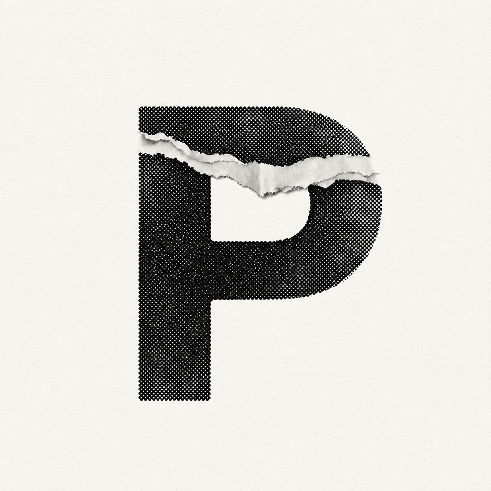
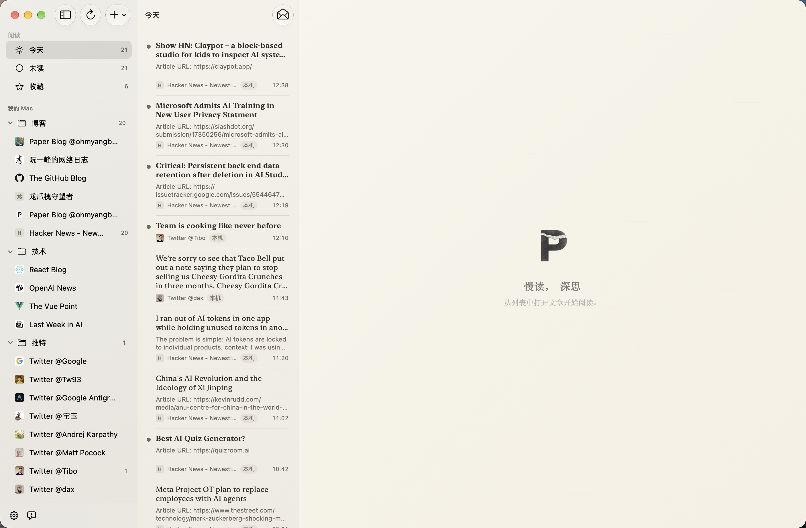
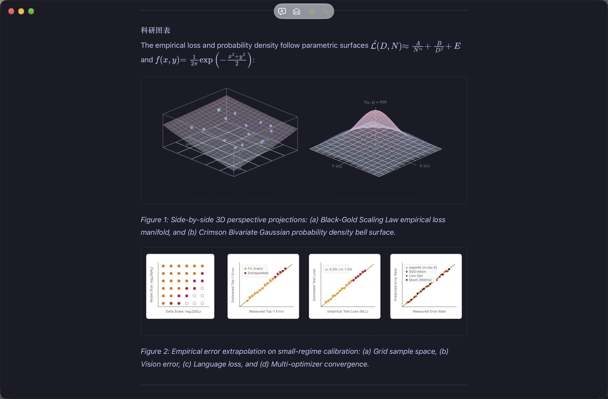
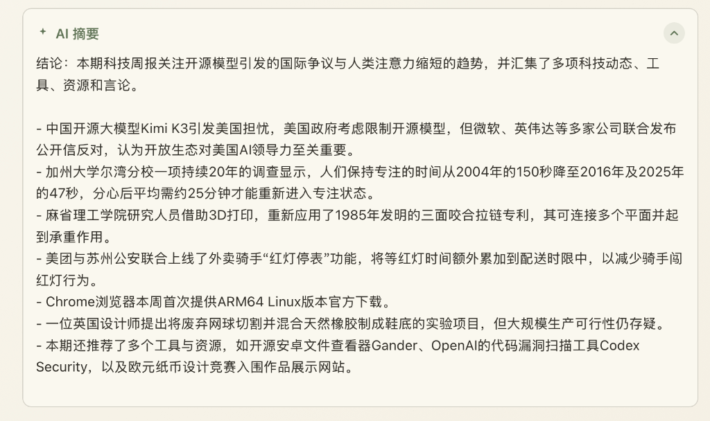
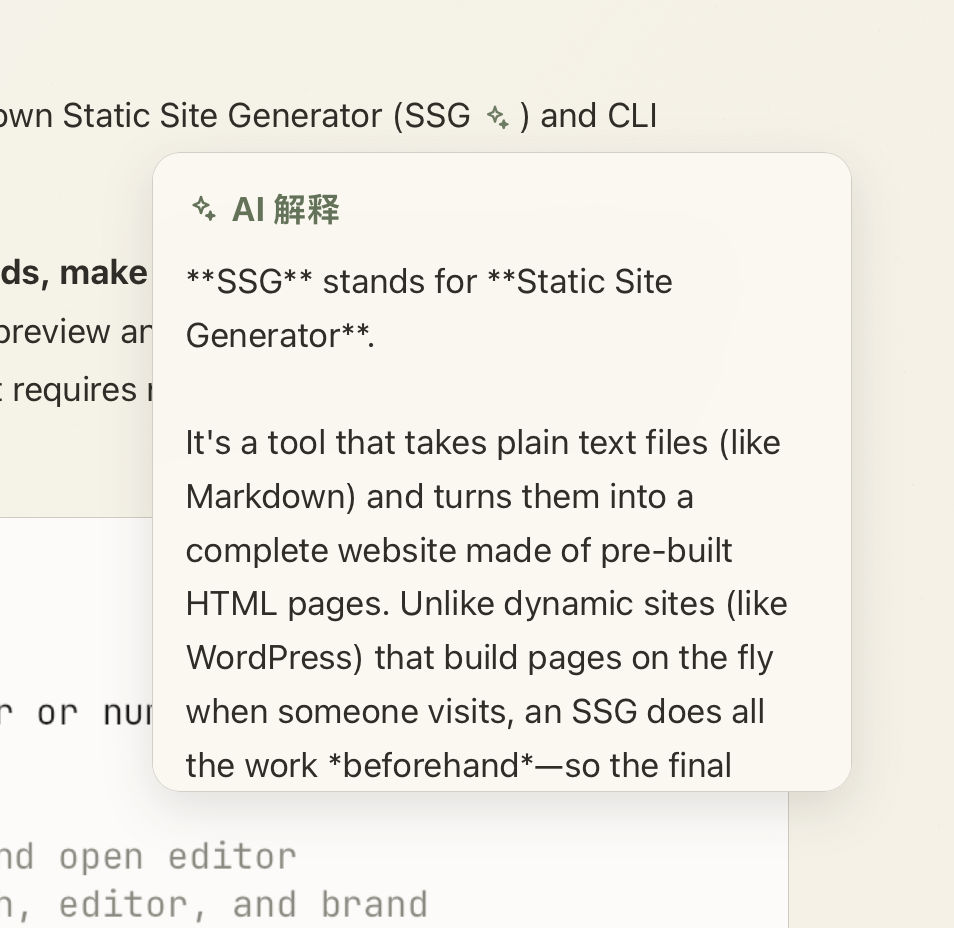
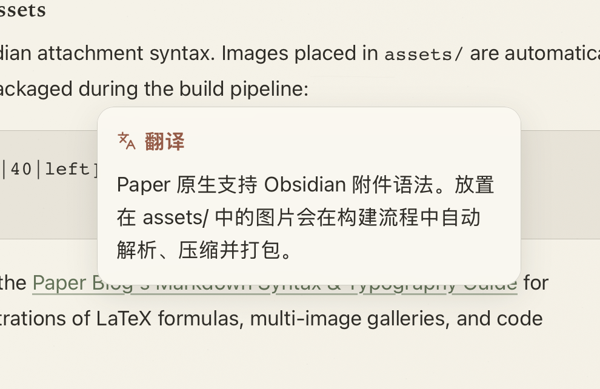
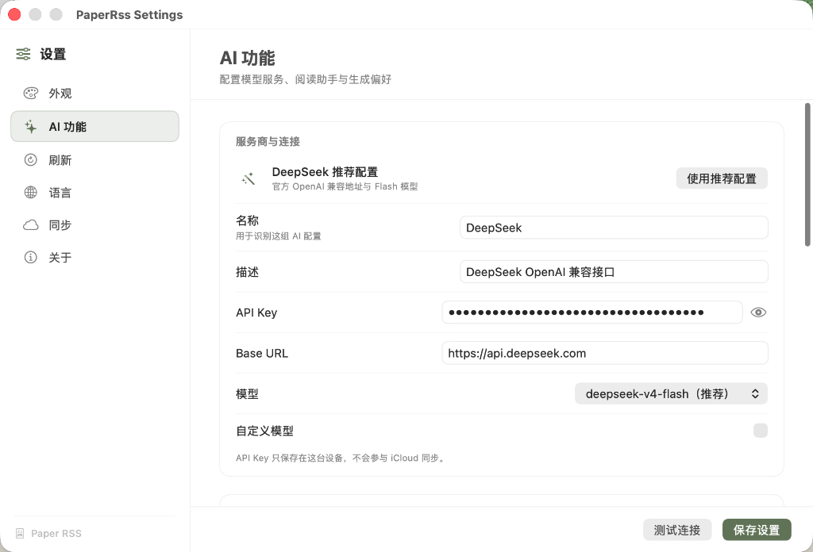
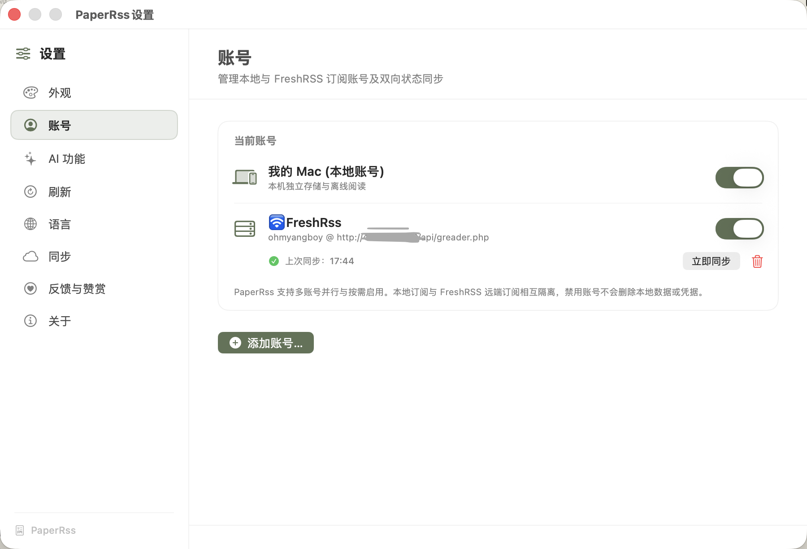

<div align="center">

  

  # PaperRss

  ***Move between languages. Keep intelligence in its place. Let reading return to its pure, immersive essence.***

  **English** · [简体中文](README.md)

  [](https://github.com/ohmyangboy/PaperRss/releases)
[](https://github.com/ohmyangboy/PaperRss)
[](LICENSE)

  [Website](https://ohmyangboy.github.io/PaperRss/) · [Download Latest v1.3.0-beta.1](https://github.com/ohmyangboy/PaperRss/releases/latest) · [Feedback](https://github.com/ohmyangboy/PaperRss/issues)

</div>

---

## About PaperRss

**PaperRss** is a modern, paper-inspired RSS reader for macOS featuring a serene and minimalist immersive interface, bilingual translation, and configurable AI capabilities — placing full control in the reader's hands.

With no sticky chatbots or intrusive LUIs, PaperRss champions active reading with restrained AI enhancements that quietly blend into the background.

**Reading First, AI Second**

_This project is inspired by another outstanding open-source RSS reader, [NetNewsWire](https://github.com/Ranchero-Software/NetNewsWire/)._

## Highlights

- **Immersive Paper-like Reading**: Serif typography tailored for long-form articles, light/dark themes, and dependable three-column navigation.
- **On-Demand AI Summaries**: Every feature is completely optional — turn AI off entirely if you prefer, or trigger it on demand with the `V` shortcut.
- **Contextual Selection Tools**: Translate, explain, or query selected text with full article context.
- **Custom Model Integration**: Bring your own DeepSeek or OpenAI-compatible API keys, with customizable system prompts.
- **Multi-Account Support**: Currently supports local accounts and FreshRSS synchronization.

## Screenshots

### Immersive Paper-like Reading






### AI Full-Article Summary



### Contextual Explanation and Translation

<p align="center">
  
  
</p>

### AI Model Configuration



### Multi-Account Integration



## Download and Installation

Download the latest `.dmg` installer from [Releases](https://github.com/ohmyangboy/PaperRss/releases) and drag PaperRss into your Applications folder.

As this is an open-source Beta release without paid Apple notarization, macOS may show a "damaged" or "cannot be opened" warning on first launch. You can resolve this using any of the following options:

1. **Option 1 (Recommended)**: Double-click `join-beta.command` inside the DMG image to automatically remove the quarantine flag;
2. **Option 2**: Go to macOS **System Settings** → **Privacy & Security**, scroll down to the Security section, and click **Open Anyway**;
3. **Option 3**: Run the following command in Terminal:
   ```bash
   xattr -dr com.apple.quarantine /Applications/PaperRss.app
   ```

_As PaperRss is actively being refined, we welcome and appreciate your feedback and interest. Official Apple notarization will be considered in future releases._

## Build from Source

Requirements: macOS 14.0+, Xcode 15.0+, Swift 5.9+.

```bash
git clone https://github.com/ohmyangboy/PaperRss.git
cd PaperRss
swift build -c release

# Or open with Xcode
open PaperRss.xcodeproj
```

## Support and Feedback

If PaperRss improves your daily reading experience, you can support independent development and ongoing maintenance via WeChat Pay or [PayPal](https://paypal.me/ohmyangboy).

Or simply leave a free **star** — it makes the author's day ;D

<div align="center">
  
  <p><i>Thank you to every reader who loves independent software and mindful reading.</i></p>
</div>

For bugs, feature ideas, and code improvements, please open a [GitHub Issue](https://github.com/ohmyangboy/PaperRss/issues), leave a message on [social media](https://xhslink.cn/m/972wHfC16uj), or contact via email at `ohmyangboy@gmail.com`.

## License

PaperRss is open-sourced under the [GNU General Public License v3.0](LICENSE).