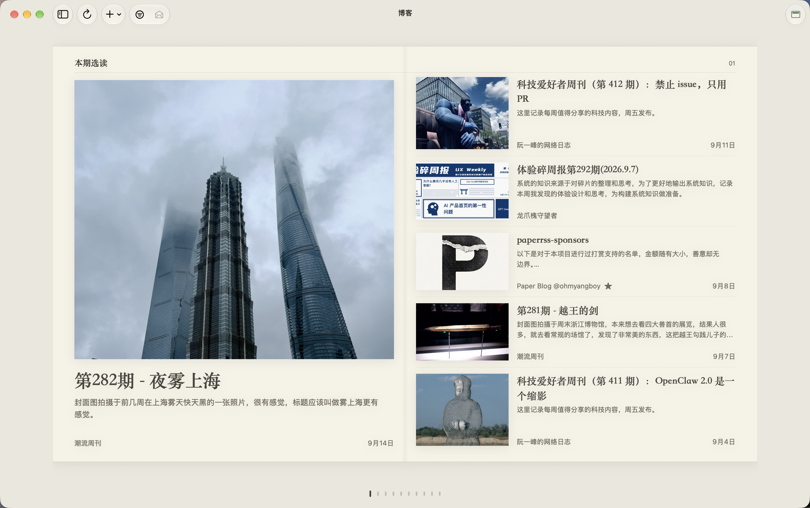

<div align="center">

  

  # PaperRss

  ***Move between languages. Keep intelligence in its place. Let reading return to its pure, immersive essence.***

  **English** · [简体中文](README.md)

  [](https://github.com/ohmyangboy/PaperRss/releases)
[](https://github.com/ohmyangboy/PaperRss)
[](LICENSE)
[](https://github.com/ohmyangboy/PaperRss/releases)

  [Website](https://ohmyangboy.github.io/PaperRss/) · [Stable v1.4.3](https://github.com/ohmyangboy/PaperRss/releases/latest) · [Feedback](https://github.com/ohmyangboy/PaperRss/issues)

</div>

---

## About PaperRss

**PaperRss** is a modern, paper-inspired RSS reader for macOS featuring a serene and minimalist immersive interface, bilingual translation, and configurable AI capabilities — placing full control in the reader's hands.

With no sticky chatbots or intrusive LUIs, PaperRss champions active reading with restrained AI enhancements that quietly blend into the background.

**Reading First, AI Second**

_This project is inspired by another outstanding open-source RSS reader, [NetNewsWire](https://github.com/Ranchero-Software/NetNewsWire/)._

## Highlights

- **Immersive Magazine View & Metal Fold Turning**: Reimagined timeline browsing with Balanced Duo editorial layouts, automatic article preview extraction, realistic 3D paper fold turning with native audio, and a scrubbing page rail.
- **Immersive Paper-like Reading**: Serif typography tailored for long-form articles, light/dark themes, independent CJK and Latin font settings for bodies, headings and translations, and fluid transitions between list and magazine styles.
- **Storage Governance & Automated Retention**: Configurable article retention periods (180 days default / 1 year / keep forever), permanent preservation for unread/starred items, tombstone resurrection protection, and background database compaction.
- **Rendering Engine & LaTeX Math**: Re-engineered article preparation pipeline with native MathJax typesetting and markdown formula shielding for technical articles.
- **On-Demand AI Summaries**: Every feature is completely optional — turn AI off entirely if you prefer, or trigger it on demand with the `V` shortcut.
- **Contextual Selection Tools**: Translate, explain, or query selected text with full article context.
- **On-Demand Timeline Translation**: Translate visible foreign titles and summaries across list, timeline-card and magazine views; move to a title's left side to reveal the original briefly.
- **Feature-routed AI Integration**: Store separate API keys and model catalogs for OpenAI-compatible endpoints, DeepSeek, and Google Gemini; summaries, bilingual reading, title translation and each selection action can use different models without hiding existing artifacts.
- **Multi-Account Support**: Supports local accounts and FreshRSS / Miniflux server synchronization.

For more upcoming features and bugfix plans, see [weekly.md](./weekly.md).

### AI service configuration

Open **Settings → AI Features**. **Providers & Models** manages only connections, local API keys, and confirmed model catalogs for the built-in OpenAI-compatible, DeepSeek, and Google Gemini providers or custom endpoints. **Feature Routing** independently enables and selects a model for summaries, bilingual translation, title translation, selection translation, explanation, and Q&A. Translation preferences split automatic translation into **Article Content** and **List Titles**: enabling article translation also enables list-title translation, while list titles may be enabled on their own. Move to a title's left-side hot zone for 300ms to reveal the original; a one-time coachmark appears on first use. Google Gemini uses the official OpenAI-compatible endpoint `https://generativelanguage.googleapis.com/v1beta/openai` and requires a Gemini API key.

On first launch after upgrading, the former single AI configuration is bound to all features without dropping its API key, model, toggles, or custom prompt. Legacy settings keys remain for rollback compatibility. API keys stay in local app preferences and are not included in iCloud sync.

## Screenshots

### Immersive Paper-like Reading





### AI Full-Article Summary


### Contextual Explanation and Translation

<p align="center">
  
  
</p>

### AI Model Configuration


### Multi-Account Integration


## Download and Installation

**Stable v1.4.3 (Build 38)** adds separate CJK and Latin font settings and on-demand timeline title and summary translation, refines translated-title interactions, and includes fixes for article extraction, dark-paper images and Dock icon behavior. Recommended for all users. See the [changelog](CHANGELOG.md).

Download the latest `.dmg` installer from [Releases](https://github.com/ohmyangboy/PaperRss/releases), open it, and drag PaperRss into your Applications folder. That's it.

> 📝 Note: The signing issue has been resolved — all artifacts are Developer ID signed and Apple notarized, so the "cannot be verified" warning is gone for good. Release cadence will speed up from here; thanks for your patience.

### Homebrew

Requires macOS 14+, with support for Apple Silicon and Intel Macs. Install with:

```bash
brew install --cask ohmyangboy/tap/paperrss
```

To update:

```bash
brew update
brew upgrade --cask --greedy ohmyangboy/tap/paperrss
```

PaperRss supports in-app updates; `--greedy` includes it in Homebrew upgrade checks.

Already installed via DMG? Quit PaperRss, then run the following to replace the app and let Homebrew manage it. Your subscriptions, reading history and settings are preserved:

```bash
brew update
brew install --cask --force ohmyangboy/tap/paperrss
```

This installs the stable version in the tap. Skip this step if you are using a newer beta to avoid downgrading.

Tap and installation details: [ohmyangboy/homebrew-tap](https://github.com/ohmyangboy/homebrew-tap).

### Install via curl

No Homebrew needed. Quit PaperRss, then run:

```bash
curl -fsSL https://ohmyangboy.github.io/PaperRss/install.sh | bash
```

The script downloads the latest stable release from GitHub, verifies SHA-256, the app signature and Gatekeeper assessment, then installs it in `/Applications`. Run the same command again to update. Subscriptions, reading history and settings are preserved; newer app versions are not downgraded. If you installed with Homebrew, continue using `brew upgrade`.

Download and verify without installing:

```bash
curl -fsSL https://ohmyangboy.github.io/PaperRss/install.sh | bash -s -- --dry-run
```

To install in your personal Applications folder, use `bash -s -- --app-dir "$HOME/Applications"` at the end of the command. The script is deployed with the website and automatically follows stable GitHub releases.

## Build from Source

Toolchain requirements: **Xcode 26.0+** (the sources use macOS 26 SDK APIs such as `glassEffect`), a Swift 6.0 toolchain, and a host that can install Xcode 26 (macOS 15.6+). The built app still runs on macOS 14.0+.

```bash
git clone https://github.com/ohmyangboy/PaperRss.git
cd PaperRss
swift build -c release
```

Day-to-day development and verification:

```bash
./scripts/dev.sh              # build and launch the app
./scripts/dev.sh --isolated   # run with a temporary data directory, leaving your main instance untouched
./scripts/verify.sh --core    # Swift unit and regression tests (see the script header for all lanes)
```

Or open `PaperRss.xcodeproj` in Xcode, select the **PaperRss** scheme and **My Mac**, then run.

Notes for forks:

- The project commit includes the original author's signing team (`DEVELOPMENT_TEAM`). Pick your own team under Signing & Capabilities, or pass `CODE_SIGNING_ALLOWED=NO` for command-line builds.
- The `build/` and `.build/` caches record absolute paths. After **moving the repository folder**, run `./scripts/clean.sh --apply` (use `./scripts/clean.sh` to preview) before building again.

## Support and Feedback

If PaperRss improves your daily reading experience, you can support independent development and ongoing maintenance via WeChat Pay or [PayPal](https://paypal.me/ohmyangboy).

Or simply leave a free **star** — it makes the author's day ;D

<div align="center">
  
  <p><i>Thank you to every reader who loves independent software and mindful reading.</i></p>
</div>

For bugs, feature ideas, and code improvements, please open a [GitHub Issue](https://github.com/ohmyangboy/PaperRss/issues), leave a message on [social media](https://xhslink.cn/m/972wHfC16uj), or contact via email at `ohmyangboy@gmail.com`.

## Privacy, Content, and Third-Party Software

PaperRss is local-first, not completely offline. Subscriptions and extracted article caches are stored locally by default. The client connects directly to relevant third parties when refreshing feeds, synchronizing FreshRSS / Miniflux, loading publisher pages or images, checking for updates, or invoking an AI feature. Depending on the selected AI action, all or part of an article may be sent to the provider, so review that provider's terms before use.

- [Privacy Policy](PRIVACY.md)
- [Content and Copyright Notice](CONTENT_NOTICE.md)
- [Third-Party Software Notices](THIRD_PARTY_NOTICES.md)
- [Website legal and privacy page](https://ohmyangboy.github.io/PaperRss/en/legal.html)

## License

PaperRss is open-sourced under the [GNU General Public License v3.0](LICENSE).

---

## Contributor

Special thanks to:

[@ProudBenzene](https://github.com/ProudBenzene)

Thank you to everyone who has contributed bug reports, detailed feedback, and valuable suggestions. Your contributions help make PaperRss better. ❤️

### Supporters

Thank you also to everyone who has supported PaperRss with a donation.

[](https://ohmyangboy.github.io/blog/posts/paperrss-sponsors/)

The preview updates with each website deployment. Click for the latest complete list; image caching may delay refreshes.

## Star History

<a href="https://www.star-history.com/?repos=ohmyangboy%2Fpaperrss&type=date&legend=top-left">
 <picture>
   <source media="(prefers-color-scheme: dark)" srcset="https://api.star-history.com/chart?repos=ohmyangboy/paperrss&type=date&theme=dark&legend=top-left" />
   <source media="(prefers-color-scheme: light)" srcset="https://api.star-history.com/chart?repos=ohmyangboy/paperrss&type=date&legend=top-left" />
   
 </picture>
</a>
