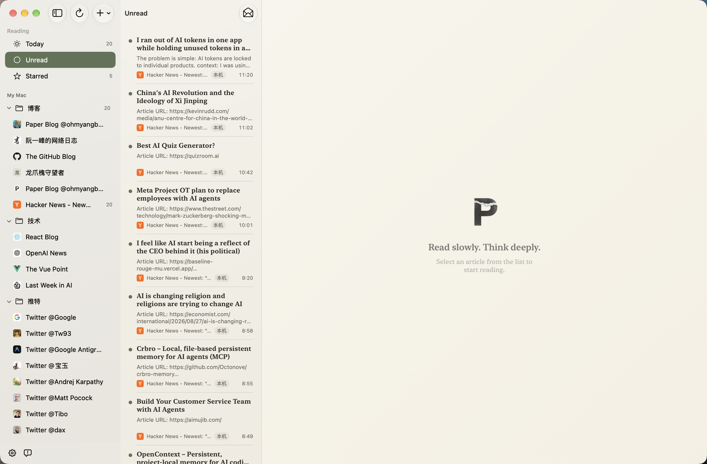
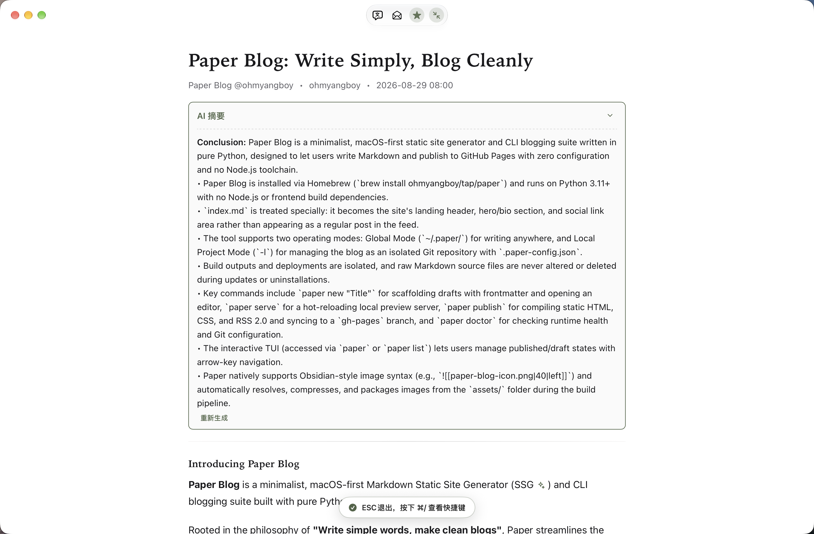

<div align="center">

  

  # PaperRss

  ***Move between languages. Keep intelligence in its place. Let reading return to its pure, immersive essence.***

  **English** · [简体中文](README.md)

  [](https://github.com/ohmyangboy/PaperRss/releases)
[](https://github.com/ohmyangboy/PaperRss)
[](LICENSE)
[](https://github.com/ohmyangboy/PaperRss/releases)

  [Website](https://ohmyangboy.github.io/PaperRss/) · [Stable v1.3.2](https://github.com/ohmyangboy/PaperRss/releases/latest) · [Feedback](https://github.com/ohmyangboy/PaperRss/issues)

</div>

---

## About PaperRss

**PaperRss** is a modern, paper-inspired RSS reader for macOS featuring a serene and minimalist immersive interface, bilingual translation, and configurable AI capabilities — placing full control in the reader's hands.

With no sticky chatbots or intrusive LUIs, PaperRss champions active reading with restrained AI enhancements that quietly blend into the background.

**Reading First, AI Second**

_This project is inspired by another outstanding open-source RSS reader, [NetNewsWire](https://github.com/Ranchero-Software/NetNewsWire/)._

## Highlights

- **Immersive Paper-like Reading**: Serif typography tailored for long-form articles, light/dark themes, and dependable three-column navigation.
- **Rendering Engine & LaTeX Math**: Re-engineered article preparation pipeline with native MathJax typesetting and markdown formula shielding for technical articles.
- **On-Demand AI Summaries**: Every feature is completely optional — turn AI off entirely if you prefer, or trigger it on demand with the `V` shortcut.
- **Contextual Selection Tools**: Translate, explain, or query selected text with full article context.
- **Feature-routed AI Integration**: Store separate API keys and model catalogs for OpenAI-compatible endpoints, DeepSeek, and Google Gemini; summaries, bilingual reading, and each selection action can use different models without hiding existing artifacts.
- **Multi-Account Support**: Supports local accounts and FreshRSS server synchronization.

For more upcoming features and bugfix plans, see [weekly.md](./weekly.md).

### AI service configuration

Open **Settings → AI Features**. **Providers & Models** manages only connections, local API keys, and confirmed model catalogs for the built-in OpenAI-compatible, DeepSeek, and Google Gemini providers or custom endpoints. **Feature Routing** independently enables and selects a model for summaries, bilingual translation, selection translation, explanation, and Q&A. Google Gemini uses the official OpenAI-compatible endpoint `https://generativelanguage.googleapis.com/v1beta/openai` and requires a Gemini API key.

On first launch after upgrading, the former single AI configuration is bound to all five features without dropping its API key, model, toggles, or custom prompt. Legacy settings keys remain for rollback compatibility. API keys stay in local app preferences and are not included in iCloud sync.

## Screenshots

### Immersive Paper-like Reading






### AI Full-Article Summary


### Contextual Explanation and Translation

<p align="center">
  
  
</p>

### AI Model Configuration


### Multi-Account Integration


## Download and Installation

**Stable v1.3.2 (Build 21)** brings multi-provider AI, model-aware translation and in-place translated text, plus unread filtering and reading appearance improvements. Recommended for all users. See the [changelog](CHANGELOG.md).

Download the latest `.dmg` installer from [Releases](https://github.com/ohmyangboy/PaperRss/releases), open it, and drag PaperRss into your Applications folder. That's it.

> 📝 Note: The signing issue has been resolved — all artifacts are Developer ID signed and Apple notarized, so the "cannot be verified" warning is gone for good. Release cadence will speed up from here; thanks for your patience.

## Build from Source

Requirements: macOS 14.0+, Xcode 15.0+, Swift 5.9+.

```bash
git clone https://github.com/ohmyangboy/PaperRss.git
cd PaperRss
swift build -c release

# Or open with Xcode
open PaperRss.xcodeproj
```

## Support and Feedback

If PaperRss improves your daily reading experience, you can support independent development and ongoing maintenance via WeChat Pay or [PayPal](https://paypal.me/ohmyangboy).

Or simply leave a free **star** — it makes the author's day ;D

<div align="center">
  
  <p><i>Thank you to every reader who loves independent software and mindful reading.</i></p>
</div>

For bugs, feature ideas, and code improvements, please open a [GitHub Issue](https://github.com/ohmyangboy/PaperRss/issues), leave a message on [social media](https://xhslink.cn/m/972wHfC16uj), or contact via email at `ohmyangboy@gmail.com`.

## Privacy, Content, and Third-Party Software

PaperRss is local-first, not completely offline. Subscriptions and extracted article caches are stored locally by default. The client connects directly to relevant third parties when refreshing feeds, synchronizing FreshRSS, loading publisher pages or images, checking for updates, or invoking an AI feature. Depending on the selected AI action, all or part of an article may be sent to the provider, so review that provider's terms before use.

- [Privacy Policy](PRIVACY.md)
- [Content and Copyright Notice](CONTENT_NOTICE.md)
- [Third-Party Software Notices](THIRD_PARTY_NOTICES.md)
- [Website legal and privacy page](https://ohmyangboy.github.io/PaperRss/en/legal.html)

## License

PaperRss is open-sourced under the [GNU General Public License v3.0](LICENSE).

---

## Contributor

Special thanks to:

[@ProudBenzene](https://github.com/ProudBenzene)

Thank you to everyone who has contributed bug reports, detailed feedback, and valuable suggestions. Your contributions help make PaperRss better. ❤️
