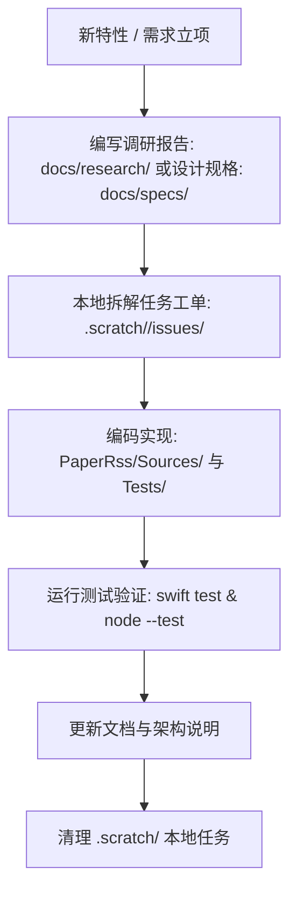

# PaperRss 仓库目录结构与文件组织规范 (DIRECTORY_SPEC)

本文档定义 PaperRss 代码仓库的顶级目录职责、子目录划分、文件存放规范、静态资产管理原则以及跨平台 / 跨 Agent 协作标准。所有开发者与 AI 智能体（Antigravity、Claude Code、Codex 等）在新增、修改、重构或归档文件时必须严格遵循本规范。

---

## 1. 顶级目录架构总览

```
PaperRss/
├── 📱 PaperRss/               # 原生客户端源码 (Swift / SwiftUI / Resources)
│   ├── Sources/Core/         # 纯逻辑核心库 (PaperRssCore)
│   ├── Sources/App/          # 原生 UI 与交互层 (PaperRssDesktop)
│   └── Resources/            # 图标、字串表、Info.plist、Entitlements
├── 🛠️ PaperRss.xcodeproj      # 原生 Xcode 工程 (双端 Scheme、编译配置)
├── 📦 Package.swift           # SPM 依赖管理与 CLI 构建配置
│
├── 🧪 Tests/                  # 统一测试套件 (Swift 核心单元测试 + Node.js Web测试)
│
├── 🌐 website/                # 官方落地页源码 (中英双语 / Vanilla Web 技术栈)
│   ├── assets/               # 落地页专用图像与视觉素材
│   ├── en/ & zh-CN/          # 国际化子目录
│   └── index.html ...        # 页面模板与脚本
│
├── 📚 docs/                   # 纯粹的项目研发知识库 (Markdown)
│   ├── DIRECTORY_SPEC.md     # 仓库组织与规范定义 (即本文档)
│   ├── specs/                # 功能特性设计规格书 (RFC / Specs)
│   ├── research/             # 架构调研与技术可行性分析报告
│   └── audits/               # 历史代码审计与系统检修记录
│
├── 🎨 assets/                 # 仓库级核心视觉与展示资产 (README截图、DMG背景、Logo原图)
├── ⚙️ scripts/                # 自动化工程脚本 (打包、发布、背景生成、本地预览)
├── 🤖 .agents/                # 全局 AI Agent 规范中心 (Rules / Docs / Skills / Workflows)
└── 📝 .scratch/               # 本地特性工单与分诊跟踪 (Git 忽略)
```

---

## 2. 各目录职责与存放规则

### 2.1 原生客户端源码 (`PaperRss/`)
- **`PaperRss/Sources/Core/`**：
  - **定位**：不依赖任何 UI 框架的底层纯逻辑库（Target: `PaperRssCore`）。
  - **内容**：数据模型（`Models.swift`）、存储状态与响应式总线（`AppStore.swift`）、网络与 Feed 解析（`FeedService.swift`、`FeedParser.swift`、`OPMLService.swift`）、AI 客户端（`LLMService.swift`）、CloudKit 镜像同步（`CloudSyncService.swift`）、国际化与安全（`I18N.swift`、`KeychainStore.swift`）。
  - **规则**：严禁在此目录引入 SwiftUI 或 AppKit/UIKit 专有组件。
- **`PaperRss/Sources/App/`**：
  - **定位**：基于 SwiftUI 的客户端界面与系统桥接（Product: `PaperRssDesktop`）。
  - **内容**：主三栏导航视图（`RootView.swift`、`ThreeColumnSplitView.swift`）、WebView 划词阅读器（`ArticleReaderView.swift`）、多 Tab 设置窗口（`SettingsView.swift`）、系统通知与 Dock Badge 联动（`MacSystemAttentionController.swift`）。
  - **规则**：macOS 与 iOS 的 WebView Coordinator 必须保持同步演进。
- **`PaperRss/Resources/`**：
  - **内容**：`Assets.xcassets` 图标集、`Localizable.xcstrings` 国际化字串、双端 `Info.plist` 与权限声明模板。

### 2.2 自动化测试 (`Tests/`)
- **定位**：全仓库测试套件唯一根目录（扁平化结构）。
- **内容**：
  - **Swift 测试**：`PaperRssCoreTests.swift`、`ReaderShortcutPolicyTests.swift` 等，通过 `swift test` 驱动。
  - **Web / JS 测试**：`website-locale.test.mjs`、`reader-shortcuts.test.mjs`、`selection-assistant-sync.test.mjs` 等，通过 `node --test Tests/*.test.mjs` 驱动。
- **规则**：`Package.swift` 已配置将 `.test.mjs` 显式排除在 SPM 编译之外；新增测试用例直接存放在 `Tests/` 根层级。

### 2.3 官方落地页与 CI 部署 (`website/`)
- **定位**：产品官方网站的**唯一源码与静态资源目录**。
- **技术栈**：Vanilla HTML5 + 原生 CSS + ES Modules，零构建打包器依赖。
- **部署规范**：
  - 弃用任何向 `docs/` 手动同步的机制。
  - 由 `.github/workflows/deploy-pages.yml` 监听 `website/**` 变更，通过 GitHub Actions 自动化流水线直接将 `website/` 发布至 GitHub Pages。
- **目录结构**：
  - `website/assets/`：落地页专属配图与说明图。
  - `website/zh-CN/` & `website/en/`：多语言版本。

### 2.4 研发文档与知识库 (`docs/`)
- **定位**：项目专属的技术与架构知识库，**严禁放置任何 HTML 发布副本**。
- **子目录划分**：
  - **`docs/specs/`**：功能特性规格设计书（RFC / Specifications）。新功能立项、协议设计草案统一存放于此。
  - **`docs/research/`**：技术调研报告、竞品架构分析、第三方协议可行性研究（如 FreshRSS、NetNewsWire 架构）。
  - **`docs/audits/`**：代码质量审查报告、架构体检记录（按日期命名，如 `2026-08-05-architecture-audit.md`）。

### 2.5 视觉与展示资产 (`assets/`)
- **定位**：仓库级通用多媒体资源库。
- **内容**：
  - `assets/app-icon.png`：应用高清原图。
  - `assets/dmg-background.png`：macOS 安装包 DMG 视窗背景。
  - `assets/wechat-sponsor-qr.jpg`：赞助二维码。
  - `assets/screenshots/`：`README.md` 及项目文档引用的高清功能截屏。
- **维护原则**：与 `website/assets/` 物理隔离，各自按场景维护，禁止跨目录乱引。

### 2.6 自动化脚本 (`scripts/`)
- **内容**：
  - `scripts/dev.sh`：本地快速编译与启动 App。
  - `scripts/build_dmg.sh` / `scripts/archive.sh`：打包与导出 `.app` / `.dmg` 安装镜像。
  - `scripts/release.sh`：全自动执行测试、编译、制作 DMG、打 Tag 并推送 GitHub Release。
  - `scripts/preview_website.sh`：本地启动轻量 HTTP 服务器预览 `website/`。
  - `scripts/generate_dmg_background.swift` / `scripts/apply_icon.py`：资产辅助生成工具。

### 2.7 AI Agent 规范中枢 (`.agents/`)
- **定位**：所有 AI 编程助手（Antigravity、Claude Code、Codex、Cursor 等）的统一上下文与规则中枢。
- **结构**：
  - **`.agents/docs/`**：
    - `domain.md`：单上下文领域文档指引。
    - `issue-tracker.md`：基于 `.scratch/` 的本地工单生命周期与 Markdown 追踪标准。
    - `triage-labels.md`：标准分诊标签（`needs-triage`、`in-draft`、`ready-for-agent` 等）。
  - **`.agents/rules/`**：全局工程规则（如验证工作流 `verification_workflow.md`、UI 设计语言 `prompt_design_language.md`）。
  - **`.agents/skills/`**：工作区自定义技能工具。
- **规则**：根目录 `CLAUDE.md` 或其他 AI 入口文件必须作为轻量路由指向 `.agents/`，确保跨工具规则一致。

### 2.8 本地临时工单 (`.scratch/`)
- **定位**：本地进行中的特性工单、临时会话与分诊看板。
- **规则**：
  - 严格受 `.gitignore` 保护，禁止提交至公共 Git 分支。
  - 子目录格式：`.scratch/<feature-slug>/spec.md` 与 `.scratch/<feature-slug>/issues/01-<slug>.md`。

---

## 3. 文件流转与生命周期规范



1. **立项与调研**：在 `docs/specs/` 创建功能规格草案，在 `docs/research/` 记录可行性分析。
2. **任务派发**：在 `.scratch/` 下创建子模块目录，按 `01-*.md` 拆分子工单。
3. **开发与测试**：在 `PaperRss/` 中实现功能，在 `Tests/` 中同步补充用例，确保 `swift test` 与 `node --test Tests/*.test.mjs` 100% 通过。
4. **发布与部署**：
   - 客户端发布：执行 `./scripts/release.sh <version>`。
   - 官网更新：修改 `website/` 并在 Push 到 `main` 后触发 GitHub Actions 自动部署。

---

## 4. 严禁事项 (Red Lines)

1. ❌ **严禁向 `docs/` 复制任何静态网页 HTML/JS 文件**（GitHub Pages 已由 CI 接管）。
2. ❌ **严禁在根目录下散落非标准的草稿目录（如 `drafts/`、`out/`）**。
3. ❌ **严禁将 `.scratch/` 中的本地临时工单提交至 Git**。
4. ❌ **严禁在根目录分散编写冲突的 Agent 规则，所有 AI 规范必须统一在 `.agents/` 维护**。
5. ❌ **严禁破坏 `Tests/` 扁平结构或遗留无引用的空目录**。
