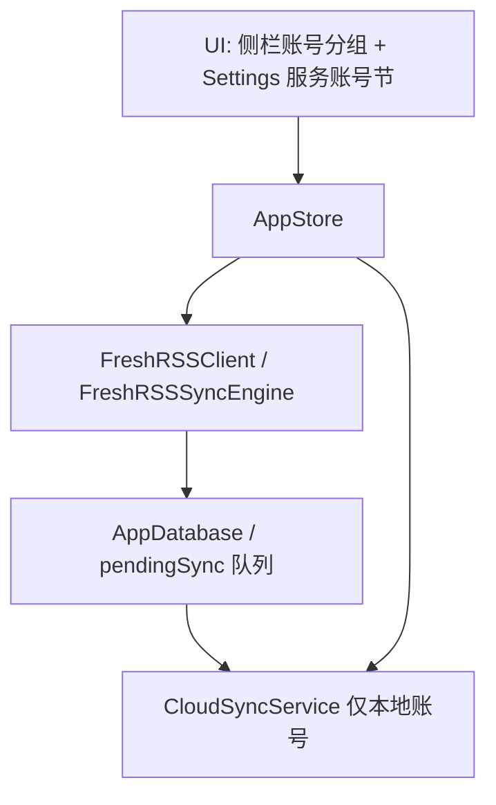

# 定稿草案：FreshRSS 服务账号集成规范 (Issue #2) — 修订版 v2

- **原始 Issue**: [#2 期待支持FreshRSS](https://github.com/ohmyangboy/PaperRss/issues/2)
- **状态**: 设计推演定稿（2026-08-13 基于 NetNewsWire 源码级对标调研修订） / Ready for Specification & Tickets
- **前置调研**:
  - [`docs/research/freshrss-api-research.md`](../docs/research/freshrss-api-research.md)（FreshRSS greader 协议规范调研）
  - [`docs/research/netnewswire-account-system-and-greader.md`](../docs/research/netnewswire-account-system-and-greader.md)（NetNewsWire 账号体系 + greader 协议源码级对标，本文修订依据）
- **协议选型**: Google Reader API (`greader.php`) 兼容协议

---

## 0. v2 修订要点（相对 v1 草案的关键变更）

> v1 草案基于协议规范推演；v2 依据 NetNewsWire 当前 main 分支源码（`Ranchero-Software/NetNewsWire`）与 BazQux "The Right Way to Sync" 一手资料修订，修正了以下事实与路线：

1. **增量同步改为"ID 差集法"**：v1 写的 `nt`（Newer Than）增量拉取是**错误姿势**（会漏掉新订阅 feed 的旧文、被翻回未读的旧文、服务端回收的文章）。正确做法是拉 unread/starred **全量 ID 列表**（`n=1000` 分页）与本地求差集；`ot` 仅用于首次/新增 feed 的历史窗口。
2. **补充写令牌 `T=`**：所有写操作（edit-tag 等）除 `Authorization: GoogleLogin auth=` 外还**必须带 `T=<token>`**（`GET /reader/api/0/token` 获取，约 30 分钟有效，过期 401/403 需重取重试）——v1 未覆盖，实现必踩。
3. **路线收敛为"轻量适配"**：不照搬 NetNewsWire 完整账号体系（每账号独立 SQLite/目录、9 类型 delegate 矩阵对单库 JSON 架构是过度设计）；**协议实现层照抄 `ReaderAPICaller`**（端点子集、token 处理、ID 编码、分页、edit-tag 批量、对账排除 pending），**账号外壳只实现一个 greader 兼容 delegate**。
4. **明确 CloudKit 边界**：服务账号数据**不进 CloudKit**（服务端权威），`CloudSyncService` 仅同步本地账号，两条同步通道互不交叉。
5. **分三阶段落地**（见 1.8）：阶段一（只读拉取 + 状态写回）价值最高、风险可控，建议先行。

---

## 1. 核心架构设计与决策

### 1.1 定位：轻量适配，不完整照搬

NetNewsWire 账号体系的复杂度来自三件事——每账号独立数据目录 + 独立 SQLite 库、9 种账号类型的 delegate 矩阵、`AccountBehaviors` 行为差异矩阵。PaperRss 是**单库 JSON + 单目标服务（FreshRSS）**，这三件事都用不上。

借鉴两点：
- **`AccountDelegate` 协议抽象**（UI 与 AppStore 只依赖协议，不感知具体服务）——降维为一个 `FreshRSSAccountDelegate` 实现，未来加 `ReaderAPIVariant` 参数即可扩展 Inoreader/BazQux/TheOldReader。
- **`AccountBehaviors` 思路**——至少表达"FreshRSS 强制 feed 必须入文件夹"这一服务端约束（`disallowFeedInRootFolder`），避免 UI 允许服务器不支持的操作。

### 1.2 账号模型（最小化）

在 `PaperRssCore/Models.swift` 中引入最小 `Account` 概念：

```swift
public enum AccountType: String, Codable, Sendable {
    case local      // 现有单库模式（nil accountID 的 Feed 即归此）
    case freshRSS   // 仅实现 greader 兼容服务；variant 参数预留扩展
}

public struct Account: Identifiable, Codable, Hashable, Sendable {
    public var id: UUID
    public var name: String
    public var type: AccountType
    public var serverURL: URL?          // FreshRSS endpoint（用户输入，如 https://nas.example.com/freshrss）
    public var username: String?
    public var allowSelfSignedCerts: Bool
    // Auth token（ClientLogin 派生）——凭据建议存 Keychain 引用而非明文落 JSON
    public var authToken: String?
}
```

数据模型改动（最小侵入）：
- `Feed` 加 `accountID: UUID?`（nil = 本地账号）。
- `AppDatabase` 加 `accounts: [Account]`；所有新字段用 `decodeIfPresent` 保证旧库兼容（Models.swift 已有成熟先例）。
- **`Entry.id` 命名空间**：本地条目 = `stableDigest(feedID|itemID)`；服务账号条目用服务器 article ID（十进制字符串），建议加前缀（如 `fr:<articleID>`）避免与本地 digest 撞车，并让 CloudKit 级联删除逻辑（`purgeEntriesFromInactiveFeeds`）能按 `accountID` 过滤。
- **folder 冲突**：不同账号可有同名文件夹，读路径分组 key 需带账号维度（`(accountID, folder)` 或复合 key）。

### 1.3 网络与凭据安全 (Security & TLS)

* **凭据隔离**: 登录界面明确引导使用 FreshRSS 网页端生成的 **API Password（应用专用密码）**，绝不使用 Web 主密码。
* **认证流**: `POST <endpoint>/accounts/ClientLogin`（表单 `Email=`/`Passwd=`，FreshRSS 接受缺省 `accountType`/`client`/`service`）→ 解析 `text/plain` 响应中的 `Auth=` 行 → 后续请求带 `Authorization: GoogleLogin auth=<token>`（注意前缀是 `GoogleLogin auth=` 而非 `Bearer `）。
* **自托管兼容**: 自定义 `URLSessionDelegate`，勾选"允许自签名 TLS 证书"时解开 ATS 证书校验；兼容 Homelab/NAS 局域网 HTTP 或自签名部署。
* **子目录部署**: 输入 URL 需规范化到 `/api/greader.php` 结尾；404 时提示检查 Nginx `PATH_INFO` 配置（详见 freshrss-api-research.md 4.1）。

### 1.4 同步引擎（ID 差集法）

**增量同步核心策略（v2 修正）**：

```
refresh(account)
 ├─ GET tag/list + subscription/list（带条件请求 304 跳过）      # 订阅树对账
 ├─ 与本地 folders/feeds 树做增删改对账（服务器为权威）
 ├─ 先写回本地待发状态（失败不阻塞拉新）
 ├─ GET stream/items/ids（s=reading-list, ot=上次拉取||3个月前, n=1000, c 递归分页）
 │    └─ 先乐观标记已读（随后对账纠正）
 ├─ 状态对账：
 │    ├─ GET stream/items/ids（unread：s=reading-list&xt=...read）→ 本地求差集 → 标记已读/未读
 │    └─ GET stream/items/ids（starred：s=...starred）→ 本地求差集 → 加/撤星标
 └─ 补正文：对"有状态但无正文"的文章
      └─ POST stream/items/contents（i= 重复参数，150 条/批）→ summary.content HTML 入库
```

- **状态映射**: 已读 `user/-/state/com.google/read`；星标 `user/-/state/com.google/starred`；全站流 `user/-/state/com.google/reading-list`；文件夹 `user/-/label/<name>`。
- **ID 两种形式**：长形式 `tag:google.com,2005:reader/item/<16位hex>` vs 短形式有符号十进制（可为负）。建议照抄 NetNewsWire：**存十进制字符串、写回时 `%.16llx` 转回 hex**（负数也能正确往返）；非数字 ID（TheOldReader 除外）判定不可发送并丢弃，避免死循环重试。
- **正文即 AI 原料**：`stream/items/contents` 返回的 `summary.content` 是 HTML，直接写入 `Entry.contentHTML`——现有 `articleText(for:)` 已优先 feed 正文，**翻译/总结/解释管线近零改动**（详见 2.6）。

### 1.5 双向状态写回（乐观更新 + 待发队列）

* **乐观更新**: 用户标记已读/加星时立即更新本地 UI 与库（现有 `markRead/toggleStar` 路径不变）。
* **待发队列**: 变动同时写入 `pendingSync` 队列（PaperRss 全 JSON 持久化，先内存 + JSON 数组即可，无需 SQLite），后台调用 `POST /reader/api/0/edit-tag` 写回。
  * 按 read/starred × add/remove 分四组，**每批 ≤1000 条**；成功删队列，失败保留待重试。
  * 定时发送（如 2 分钟一次）+ 批量阈值（如 pending > 100 立即 flush）。
* **对账防回滚**: 状态对账时**必须排除 pending 中的条目**（pending 是本地的 truth），避免"服务器旧状态把本地刚点的未读翻回来"。
* **写令牌 `T=`**（v2 补充）: 所有写操作经 `withWriteToken` 注入 `T=`；**遇 401/403 丢弃缓存 token、重取、重试一次**——否则长期运行后所有写同步静默失败。
* **离线容错**: 网络恢复后自动重发（队列幂等，edit-tag 可重复提交）。

### 1.6 CloudKit 边界（决策点）

- **服务账号的 feeds/readingStates 不进 `CloudLibrary`**：服务端是权威，进 CloudKit 会造成本机与服务器冲突、无凭据设备读到陈旧数据、删除/重命名跨设备打架。
- 最小实现：`CloudLibrary.from(_:)` 过滤 `accountID == nil` 的 feed 及其 readingStates。
- 现有 `CloudLibrary` 本就不含 entries（正文天然不进 CloudKit），服务账号正文只进本地 `articleCaches`/`contentHTML`，天然满足。

### 1.7 刷新编排（分支而非改造）

- `AppStore.refresh()` 按 `feed.accountID` 分组：本地 feed 走现有 TaskGroup 管线（并发 6 + 10s 超时）；服务账号 feed 跳过，改由独立 `FreshRSSSyncEngine.refresh(account:)`（一次"订阅树对账 + IDs + 状态对账 + 补正文"，是**每账号 1 次大请求**而非每 feed 1 次，不复用逐 feed 模型）。
- `feedFetcher` 注入点扩展为"账号刷新手柄"以保持可测试性。

### 1.8 分三阶段落地

| 阶段 | 内容 | 主要风险 |
| :--- | :--- | :--- |
| **阶段一：只读拉取 + 状态写回**（建议优先） | `Account` 模型 + `FreshRSSClient`（greader 端点子集）+ `FreshRSSSyncEngine`（订阅树对账、ID 差集、正文补拉、edit-tag 写回队列与对账）+ 侧栏账号分组 + 添加账号设置页 | `Entry.id` 命名空间与旧库迁移；同名文件夹跨账号冲突；token 过期静默失败（须 401 重取重试）；正文体积（用"有状态但无正文才补拉"控制） |
| **阶段二：订阅管理** | `quickadd`（添加订阅）、`subscription/edit`（改名/移动/退订）、`disable-tag`/`rename-tag`（文件夹）、`subscription/import`（OPML 导入服务端）；本地 `addFeed/deleteFeed/renameFolder` 按 `accountID` 分流 | **语义分叉**：服务端权威 + 本地回读对账 vs 现有"本地即事实"语义冲突，须显式分支；FreshRSS 强制 feed 入文件夹（需 UI 约束或自动建"未分类"）；订阅创建后需立即初始拉取 |
| **阶段三：完整多账号** | 多服务账号（多个 FreshRSS/未来其他 greader 服务）+ 账号启停/删除/重命名 + 每账号独立刷新调度 + 未读聚合与账号级未读数 | `EntryLibraryIndex` 全库聚合重构；刷新编排复杂度（照搬 NetNewsWire `AccountManager.refreshAll` TaskGroup + `CombinedRefreshProgress` 模式）；CloudKit 边界规则固化；AI 缓存（`AIArtifact` keyed by entryID）多账号同名 ID 隔离 |

---

## 2. 模块改动清单



1. **`PaperRssCore/Models.swift`**: 新增 `AccountType`/`Account`；`Feed` 加 `accountID: UUID?`；`AppDatabase` 加 `accounts`、`pendingSync`；服务账号 `Entry.id` 命名空间（`fr:` 前缀）；folder 分组 key 带账号维度。（阶段一）
2. **`PaperRssCore/FreshRSSClient.swift`**（新文件）: greader HTTP 客户端——ClientLogin、token、subscription/list、tag/list、stream/items/ids、stream/items/contents、edit-tag；`T=` 令牌与 401/403 重取重试；ID 十进制↔hex 编码；`n=1000` 分页与 `ot` 历史窗口。（阶段一）**协议行为直接对标 NetNewsWire `ReaderAPICaller`。**
3. **`PaperRssCore/FreshRSSSyncEngine.swift`**（新文件）: 订阅树对账、ID 差集状态同步、正文补拉、edit-tag 写回队列与对账（排除 pending）。（阶段一）
4. **`PaperRssCore/SelfSignedURLSessionDelegate.swift`**（新文件）: 自签名证书/局域网 HTTP 支持。（阶段一）
5. **`PaperRssCore/AppStore.swift`**: `refresh` 按 `accountID` 分支；`markRead/toggleStar` 对服务账号条目入队；`CloudLibrary.from` 过滤服务账号数据。（阶段一）
6. **`PaperRssCore/EntryLibraryIndex`**: 分组 key 加账号维度（同名文件夹隔离）。（阶段一）
7. **`PaperRssDesktop/.../RootView.swift`**: 侧栏按账号分组渲染（组头 + 账号名）；**`SettingsView.swift`**: 新增"服务账号"分节（endpoint + 用户名 + API 密码 → ClientLogin → 存 token；自签名开关）。（阶段一）
8. **订阅管理 UI 与分流**（阶段二）、**多账号管理**（阶段三）——按 1.8 推进。

---

## 3. 验收标准 (Acceptance Criteria)

### 阶段一
- [x] 完成协议规范调研 + NetNewsWire 源码级对标调研与方案定稿。
- [ ] 输入 FreshRSS 地址与 API 专用密码能够成功通过 `ClientLogin` 验证。
- [ ] 在自签名证书/局域网 HTTP 环境下正常连通。
- [ ] 能够成功拉取 FreshRSS 端的分类与订阅源（订阅树对账）。
- [ ] 本地点击已读/加星能实时反映，并在后台成功调用 `edit-tag` 同步至 FreshRSS Web 端（含 `T=` 令牌过期后的 401 重取重试）。
- [ ] 状态对账不把本地刚点掉的未读翻回来（排除 pending）。

### 阶段二
- [ ] 添加/删除/移动订阅与文件夹能同步到 FreshRSS Web 端。
- [ ] FreshRSS 强制"feed 必须入文件夹"的约束在 UI 中被正确表达。

### 阶段三
- [ ] 多个服务账号共存、独立刷新、未读聚合正确。

---

## 4. 参考资料

- [docs/research/netnewswire-account-system-and-greader.md](../docs/research/netnewswire-account-system-and-greader.md)（本次修订依据：NetNewsWire 源码快照 commit `ab2f35f`、mihaip/google-reader-api 规范、BazQux "The Right Way to Sync"）
- [docs/research/freshrss-api-research.md](../docs/research/freshrss-api-research.md)（协议端点/认证/踩坑细节）
- NetNewsWire 源码：`Modules/Account/Sources/Account/ReaderAPI/ReaderAPICaller.swift`（协议实现蓝本）、`ReaderAPIAccountDelegate.swift`（同步引擎蓝本）、`AccountDelegate.swift`（协议抽象蓝本）
