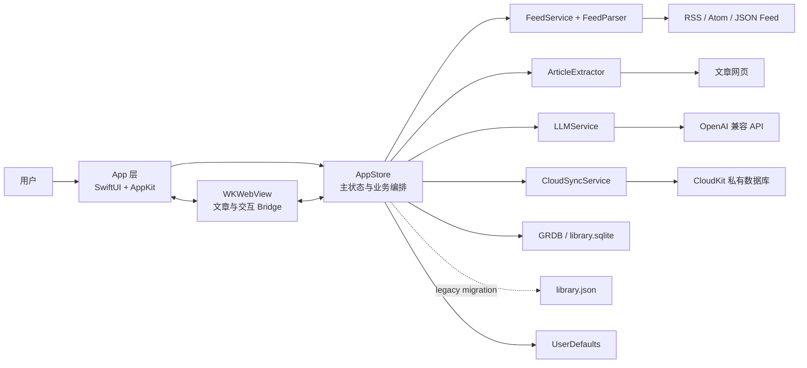

# PaperRss 技术架构

> 文档状态：当前实现说明
> 核对日期：2026-08-21
> 适用范围：PaperRss macOS 主产品、共享 Core、仓库内网站与发布链路

本文描述当前仓库已经实现的结构和运行边界。`docs/drafts/` 与 `docs/research/` 中的方案不是实现证据；代码、配置、脚本和运行结果与本文冲突时，以可执行事实为准并同步修正文档。

## 1. 架构概览

PaperRss 是本地优先的原生 RSS 阅读器。SwiftUI 负责界面组合，macOS 主窗口通过 AppKit 提供三栏与工具栏，文章正文由受控的 WKWebView 渲染；Core 层负责模型、抓取、解析、持久化、正文提取、AI 调用和可选 CloudKit 同步。

核心约束：

- 依赖方向固定为 App → Core；Core 不依赖 SwiftUI、AppKit 或 UIKit。
- `AppStore` 是运行期单一业务状态入口，View 不直接读写持久化文件或调用外部服务。
- 阅读正文进入 WebKit 前先经过白名单清洗，并由 Content Security Policy 阻止页面脚本执行。
- 网络正文、AI 请求和 CloudKit 是彼此独立的外部边界；本地阅读库不依赖它们持续在线。
- macOS 是当前产品、验证和发布主目标。仓库保留 iOS 目标与条件编译代码，但不代表 iOS 已进入当前功能范围。

## 2. 构建目标与模块

[`Package.swift`](../../Package.swift) 定义三个 Swift Package 目标：

| 目标 | 位置 | 职责 |
| --- | --- | --- |
| `PaperRssCore` | [`PaperRss/Sources/Core`](../../PaperRss/Sources/Core/) | 模型、状态、网络、解析、持久化、AI、同步和纯策略 |
| `PaperRssDesktop` | [`PaperRss/Sources/App`](../../PaperRss/Sources/App/) | macOS SwiftUI 应用及系统桥接，依赖 `PaperRssCore` |
| `PaperRssCoreTests` | [`Tests`](../../Tests/) | Core 单元测试；Node 测试由独立命令运行 |

Swift Package 的部署目标是 macOS 14。Xcode 工程另有 macOS 14 与 iOS 17 App target，共用 `Sources/Core` 和大部分 `Sources/App`；平台差异通过条件编译隔离。

### Core 层

- [`Models.swift`](../../PaperRss/Sources/Core/Models.swift)：可持久化领域模型和向后兼容解码。
- [`AppStore.swift`](../../PaperRss/Sources/Core/AppStore.swift)：`@MainActor ObservableObject`，拥有数据库、派生索引、刷新、阅读状态、正文缓存、AI 任务和同步编排。
- [`FeedService.swift`](../../PaperRss/Sources/Core/FeedService.swift) 与 [`FeedParser.swift`](../../PaperRss/Sources/Core/FeedParser.swift)：条件请求和 RSS、Atom、RDF、JSON Feed 解析。
- [`ArticleExtractor.swift`](../../PaperRss/Sources/Core/ArticleExtractor.swift)：正文提取、HTML 白名单清洗、图片 URL 归一化和段落稳定标识。
- [`LLMService.swift`](../../PaperRss/Sources/Core/LLMService.swift)：OpenAI 兼容 Chat Completions、SSE、摘要、翻译和划词问答。
- [`CloudSyncService.swift`](../../PaperRss/Sources/Core/CloudSyncService.swift)：CloudKit entitlement 检查、单记录载荷同步和按 `updatedAt` 合并。
- `OPMLService`、`I18N`、`UpdateCheckService`、`ReaderShortcutPolicy` 与 `FeedAttentionPolicy` 提供边界清晰的辅助能力。

### App 层

- [`PaperRssApp.swift`](../../PaperRss/Sources/App/PaperRssApp.swift) 创建 `AppStore`、导航模型与 macOS 系统注意力控制器，并注入应用语言环境。
- [`RootView.swift`](../../PaperRss/Sources/App/RootView.swift) 管理侧栏选择、文章选择、OPML、快捷键导航和平台分支。
- macOS 使用 [`ThreeColumnSplitView.swift`](../../PaperRss/Sources/App/ThreeColumnSplitView.swift) 将 SwiftUI 内容嵌入 `NSSplitViewController` 和原生 `NSToolbar`；iOS 分支使用 `NavigationSplitView`。
- [`ArticleReaderView.swift`](../../PaperRss/Sources/App/ArticleReaderView.swift) 组合阅读器状态、WKWebView、摘要卡片、逐段翻译和划词交互。
- [`SettingsView.swift`](../../PaperRss/Sources/App/SettingsView.swift) 编辑刷新、外观、语言、AI、同步和 macOS 提醒配置。

## 3. 状态与数据模型

正常运行期的主存储是 GRDB/SQLite。`AppDatabase` 继续作为测试、兼容解码和历史 JSON 迁移使用的可编码快照，而不是运行期主数据库：

| 数据 | 作用 | 关键稳定性 |
| --- | --- | --- |
| `Feed` | 订阅、目录、条件请求缓存与软删除标记 | UUID 长期稳定；删除通过 `isDeleted` 和 `updatedAt` 表达 |
| `Entry` | 文章元数据、Feed 正文、已读与收藏投影 | ID 为 `feed UUID + 源条目 ID` 的稳定摘要 |
| `ReadingState` | 独立保存已读/收藏状态 | 刷新重建 Entry 时保留用户状态；按更新时间合并 |
| `ArticleCache` | 清洗后的正文文本、HTML、图片和来源 URL | 与 Entry ID 关联；旧缓存加载时惰性迁移与重新清洗 |
| `AIArtifact` | 摘要、双语段落、划词结果、文章上下文和翻译记忆 | 由内容 hash、模型、语言和 Prompt 版本判定可复用性 |
| `LLMConfiguration` | 服务地址、模型、语言、推理与功能开关 | 新字段使用兼容默认值解码旧数据库 |

`EntryLibraryIndex` 是不持久化的派生读模型。每次数据库发生结构性变化时统一重建，预先生成今天、未读、收藏、按 Feed/文件夹分组的数组和计数，避免 SwiftUI 重绘时重复排序和过滤完整文章库。文章列表使用精简的 `EntryListItem`，不携带大段正文 HTML。

## 4. 本地持久化与隐私边界

### 阅读库

- `AppStore` 在用户 Application Support 下使用 `PaperRss/library.sqlite` 作为运行期主库，通过 GRDB repository 读写 Feed、Entry、阅读状态、正文缓存、账号和 AI 产物。
- 历史 `library.json` 只作为旧版本迁移来源；迁移路径保留兼容解码和备份，不继续承担正常运行期写入。
- Feed 刷新和合并在数据库 transaction 内更新文章、条件请求元数据和阅读状态投影。
- Feed 删除会同步清理本地 Entry、正文缓存和阅读状态，并把需要跨设备传播的 AI 结果压缩为 tombstone。

### 偏好与凭据

- 刷新频率、启动刷新、主题、字号、忽略版本、语言和部分 macOS 设置保存在 `UserDefaults`。
- API Key 通过 [`KeychainStore.swift`](../../PaperRss/Sources/Core/KeychainStore.swift) 中的 `LocalAPIKeyStore` 保存，但当前底层也是 `UserDefaults`：它不会进入 `AppDatabase` 或 CloudKit，也不会触发系统密码提示，但不具备 Keychain 的静态加密强度。
- `LLMConfiguration` 保存在本地 JSON；AI 输出语言独立于应用界面语言。

## 5. 主要运行链路

### 5.1 订阅与刷新

1. 用户添加 Feed 或导入 OPML，`AppStore` 先写入订阅，再只刷新新增 Feed。
2. `FeedService` 发送 `If-None-Match` 和 `If-Modified-Since`；304 只更新刷新元数据。
3. `AppStore.refresh` 最多并发六个 Feed，并在应用层为单 Feed 设置 10 秒超时。
4. `FeedParser` 根据首个非空字节选择 JSON 或 XML 解析，统一输出 `ParsedFeed`。
5. 合并阶段用稳定 Entry ID 去重，以 `ReadingState` 覆盖服务端刷新得到的状态，并重建 `EntryLibraryIndex`。
6. 刷新结果记录来源、成功/失败数和最终仍为未读的新文章，供界面状态和 macOS 注意力逻辑消费。

自动刷新由 `AppStore` 内部 Task 驱动，支持启动刷新与固定间隔；iOS 源码另有 `BGAppRefreshTask` 调度分支。

### 5.2 Reader Engine：正文获取、规范化与安全渲染

1. **统一格式规范化（Markup Normalization）**：
   - 由 `ArticleMarkupNormalizer` 统一处理原生 HTML、XML/JSON 转义 HTML、Markdown、Markdown+HTML 混合内容。
   - 使用基于 quote-aware 的线性扫描器与标签栈保护已有 HTML 块，普通内联文本支持 `swift-markdown` AST 规范化，不破坏外层容器结构。
2. **异步准备引擎（`ArticlePreparationEngine`）**：
   - 统一评估 Feed、本地 `ArticleCache` 与网页抓取候选质量。
   - 强 Feed（不少于 600 字或 200 字带图）直接采用，0 网页请求；弱 Feed 最多抓取 1 次并在明显改善时替换。
   - 统一输出严格同源的 `PreparedArticle`（包含 `text`、`html`、`imageURLs`、`baseURL`、`source` 与 `features`），杜绝各字段分散决策。
3. **通用容器评分与媒体管线**：
   - `ArticleExtractor` 通过标签栈扫描平衡容器，结合语义标签与词元打分，零站点硬编码。
   - 提取 `data-original`、`data-src`、`srcset` 恢复高清图片；前 2 张图片使用 `loading="eager"`，其余使用 `loading="lazy"`，并注入 `decoding="async"`。
4. **权威文档渲染与严格 CSP**：
   - 由 `ReaderDocumentRenderer` 统一组装 HTML 文档，内置严格 CSP (`script-src 'none'`) 并注入 `--paper-reader-top-inset` 与 `--paper-font-size` 排版变量。
5. **条件公式运行时（MathJax 4.1.2）**：
   - `ArticleMathDetector` 精准识别 TeX (`\(...\)`, `\[...\]`, `$$...$$`, `$ ... $`) 与 MathML，排除价格数字与代码块变量。
   - 仅当 `features.containsMath == true` 时注入特权本地 MathJax 运行时，普通文章零读取、零解析、零执行。

### 5.3 阅读器 Bridge

`PaperReaderBridge` 定义原生与 WebKit 的消息协议。主要消息包括滚动位置、可见段落、划词解释/提问、下一篇、列表聚焦、字号和阅读快捷键。

- Core 为正文块分配按文档顺序稳定的 `title`、`p0`、`p1` 等标识。
- 注入脚本只上报当前视口及预加载区内的有限段落，驱动懒加载翻译。
- SwiftUI 状态变化通过 `evaluateJavaScript` 增量同步摘要卡片、选择操作开关和已完成译文，避免每个 AI delta 都重载整篇文章。
- macOS 与 iOS 各有 Coordinator；修改消息名、载荷或 DOM 契约时必须同步两端和 Node 行为测试。

### 5.4 AI 管线

`LLMService` 将配置的 Base URL 归一化到 `/chat/completions`，使用 Bearer API Key 和 OpenAI 兼容消息结构：

- 摘要支持 SSE 增量输出；若服务接受 `stream: true` 却返回普通 JSON，会只针对空流结果回退到非流式请求。
- 划词解释与提问组合所选文本、附近段落和文章上下文；同一内容、模型、语言和 Prompt 版本命中本地 `AIArtifact` 时直接复用。
- 双语阅读按可见段落触发，最多四段、约 1,200 字符一批；批量响应必须保持有序 JSON，否则退回逐段翻译。
- 翻译记忆按标准化文本、Base URL、模型、目标语言和 Prompt 版本寻址，跨文章复用，并限制为最多 2,000 条。
- DeepSeek 可配置推理强度；翻译和交互式划词请求会关闭隐藏推理，以减少首个可见结果的等待。
- AI 网络失败只影响对应任务；已经完成并落盘的段落或历史 Artifact 仍可复用。

### 5.5 CloudKit

CloudKit 同步代码已经存在，但设置页明确标记为“同步功能暂未上线”，应视为受限能力而非正式产品承诺。

- 仅带 CloudKit entitlement 的 macOS 构建允许进入同步路径；纯 SPM、ad-hoc 或无权限构建会在调用框架前被拒绝。
- 同步载荷是私有数据库中的单个 `PaperRssLibrary` 记录及 JSON Asset。
- 同步内容为 Feed、ReadingState 和 AIArtifact；文章正文、ArticleCache、LLM 配置和 API Key 不同步。
- 合并以对象 ID 和 `updatedAt` 执行 last-write-wins；本地合并后重新把阅读状态投影到 Entry。
- 本地持久化后以约两秒 debounce 调度同步。该方案不是增量记录同步，数据规模受单 JSON Asset 和全量合并约束。

## 6. 系统集成与产品表面

- macOS Dock 未读角标由 `MacSystemAttentionController` 观察数据库并绘制自定义 Dock Tile；新文章系统通知路径当前被明确停用。
- `AppNavigationModel` 只承载跨系统入口的导航请求，当前用于打开未读列表。
- OPML 导入只读取 `xmlUrl` 并去重；当前导出是有效 Feed 的扁平 outline，包含 `xmlUrl` 和可选 `htmlUrl`，不保留文件夹层级。
- 更新检查通过 GitHub Releases 获取版本信息；忽略版本状态保存在本机。
- 应用语言支持跟随系统、简体中文和英文；资源来自 String Catalog，AI 目标语言是独立配置。

## 7. 网站、构建与发布

[`website/`](../../website/) 是独立的原生 HTML、CSS 和 ES Modules 静态站点，含根入口及中英文页面。GitHub Actions 在 `website/**` 或 Pages workflow 变化时，直接上传该目录并部署；`docs/` 不参与官网构建。

发布链路由 [`scripts/release.sh`](../../scripts/release.sh) 编排：

1. 运行 `swift test`。
2. 调用 Xcode archive/export 生成 macOS App。
3. 构建 DMG；优先使用 `create-dmg`，失败时回退 `hdiutil`。
4. 正式模式创建并推送 Git Tag，再通过 GitHub CLI 创建或更新 Release。

当前脚本不会运行 Node 测试，也没有 Apple notarization 步骤；网站部署由独立 Pages workflow 完成。因此“发布完成”仍需分别核对 Swift/Node 测试、签名、DMG、Release 和线上网站。

## 8. 验证结构

- `swift test`：Feed 解析、索引、OPML、HTML 清洗、正文缓存迁移、LLM 请求契约、流式响应、Cloud 合并、兼容解码、快捷键与策略。
- `swift build --product PaperRssDesktop`：验证 Core 与 macOS App 的 Swift Package 编译边界。
- `node --test Tests/*.test.mjs`：验证 WebKit Bridge/快捷键源码契约、网站 i18n/布局及仓库治理。
- 真实 UI、WebKit 媒体、系统通知、CloudKit、签名、公证和线上部署必须在对应运行环境单独验证，不能由单元测试或编译结果替代。

## 9. 已知架构边界

- `AppStore` 同时承担状态、业务用例和副作用编排，是当前最主要的集中点；新增远程账号或不同同步语义时，应先建立独立服务边界，避免继续扩大主状态对象。
- 阅读库已使用 GRDB/SQLite；历史 JSON 仅用于迁移。CloudKit 仍采用单 Asset 全量载荷，因此同步规模仍受全量编码与合并成本限制。
- 正文提取器基于规则和正则白名单，而不是完整浏览器 DOM/Readability 引擎；复杂或依赖客户端渲染的网站可能退化到 Feed 正文或打开原网页。
- OPML 模型当前只往返订阅 URL，导出不会保留 PaperRss 文件夹结构。
- `ArticleReaderView` 同时包含 SwiftUI、HTML/CSS、JavaScript 和双平台 Coordinator，是跨层变更风险最高的模块。
- API Key 当前为本机 UserDefaults 存储；若安全目标提高，应迁移到 Keychain，并提供不丢失现有配置的显式迁移。
- iCloud 同步代码与设置入口存在，但在正式上线、真实签名和多设备冲突验证完成前，不应在产品文档中宣称可用。

## 10. 变更时的事实来源

| 改动类型 | 首要核对位置 |
| --- | --- |
| 模型、迁移、稳定 ID | `Models.swift`、`AppStore.swift`、Core tests |
| Feed 协议与刷新 | `FeedService.swift`、`FeedParser.swift`、`AppStore.refresh` |
| 正文安全与渲染 | `ArticleExtractor.swift`、`ArticleReaderView.swift`、Bridge Node tests |
| AI 行为与缓存 | `LLMService.swift`、`AIArtifact`、AppStore AI methods |
| CloudKit | `CloudSyncService.swift`、AppStore sync methods、entitlement 与真实签名环境 |
| macOS 界面与快捷键 | `RootView.swift`、`ThreeColumnSplitView.swift`、`ReaderShortcutPolicy.swift` |
| 官网与发布 | `website/`、Pages workflow、`scripts/release.sh` |
