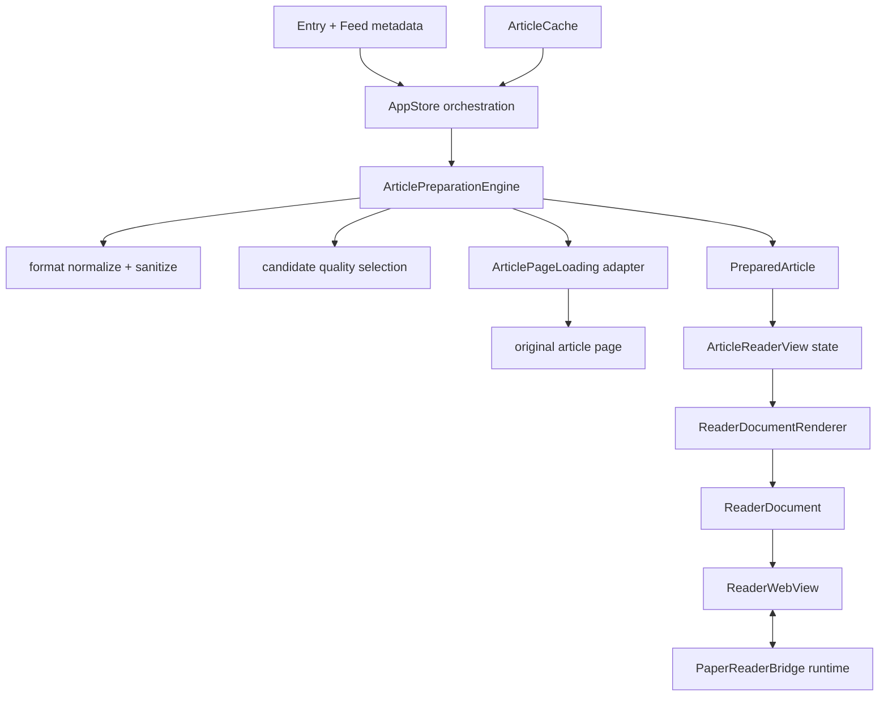

# PaperRss Reader Engine 技术计划与实现规范

- **Status**: implemented, automated & build verified, manual UI verification pending
- **核对日期**: 2026-08-21
- **适用范围**: macOS 主产品、共享 Core、现有 WKWebView Reader
- **实施状态**: 全部 6 个目标阶段及 Reviewer Findings 修复均已实施，并通过全量自动化测试套件 (226 Core + 55 Web/Bridge)、macOS 宿主 Clean Build 与 dev.sh 进程启动，待真机人工视觉与交互确认
- **跟踪方式**: 本地 tracker 归档于 `.scratch/reader-engine/goals/`

本文定义 PaperRss Reader Engine 的目标结构、分阶段实施顺序和验收门槛。各 Agent 必须先读本文，再只执行当前获准的 Goal；不得自行跨阶段、提交、推送或发布。

## 1. Problem Statement

用户遇到的不是单一站点故障，而是一类真实世界正文兼容问题：

- Feed 可能提供完整 HTML、XML 转义 HTML、Markdown、HTML/Markdown 混合内容或纯文本；同一 Feed 的不同条目也可能采用不同格式。
- 当前正文来源由缓存和少量域名/路由特判驱动，完整 Feed 正文可能被忽略，继而抓取质量更差的网页片段。
- 网页正文提取依赖正则和容器启发式；lazy image、`srcset`、嵌套容器和复杂表格可能丢失或退化。
- TeX/MathML 在清洗后没有可信的本地公式运行时，因而显示为源码。
- Reader 的 CSS、文档组装、WebKit wrapper、双平台 Coordinator、JS Bridge、AI 摘要、翻译和划词逻辑集中在一个约 5,000 行的文件中，修改风险和验证成本过高。

目标不是为虎嗅、少数派、人人都是产品经理或 Lilian Weng 添加站点补丁，而是建立按**内容结构、完整度和渲染特征**工作的统一 Reader Engine。

## 2. Solution

保留 WKWebView 作为正式正文 renderer，不推倒现有 Feed、SQLite、AI、翻译和 Bridge 能力。在现有链路中建立两个深模块：

1. Core 的 `ArticlePreparationEngine`：隐藏格式识别、规范化、安全清理、候选评分、网页提取、缓存升级和特征检测。
2. App 的 `ReaderDocumentRenderer`：隐藏 Header、正文、样式、运行时能力和完整文档组装。

阅读器只消费一次准备结果：

```swift
func prepareArticle(for entry: Entry) async throws -> PreparedArticle
```

`PreparedArticle` 至少提供 `text`、`html`、`imageURLs`、`baseURL`、`source` 和 `features`。正文文本、HTML、图片和 base URL 必须来自同一候选，不能再由分离调用在不同时间分别决定。

## 3. User Stories

1. 作为读者，我希望完整 Feed 正文被直接采用，以便更快打开文章并减少不必要的网络请求。
2. 作为读者，我希望 Feed 内的 Markdown 显示为标题、强调、列表、链接、图片和代码，而不是裸露符号。
3. 作为读者，我希望 HTML、转义 HTML、Markdown 和混合内容使用一致的排版与安全规则。
4. 作为读者，我希望正文图片按原顺序显示、保持比例，并在网络失败时不阻断文字阅读。
5. 作为读者，我希望宽图、长图、代码和表格在窄窗口中可读，不挤破正文布局。
6. 作为学术文章读者，我希望常见 TeX 和 MathML 公式正确显示，非公式文章不承担公式引擎成本。
7. 作为双语阅读用户，我希望正文重构不破坏稳定段落 ID、可见段落检测和增量翻译。
8. 作为键盘和划词用户，我希望滚动、快捷键、选择、解释和问答行为保持一致。
9. 作为离线用户，我希望抓取失败时仍能看到缓存或 Feed 中最好的可用正文。
10. 作为本地优先用户，我希望文章内容、URL 和正文判断不被发送到新的远程服务或写入遥测。
11. 作为维护者，我希望相同结构的未知 Feed 自动受益，而不是继续积累域名分支。
12. 作为维护者，我希望每个阶段都能单独回退和验收，不在一次改动中混合架构迁移、样式变化和新运行时。

## 4. 已核实的当前架构

当前实际链路为：

```text
RSS / Atom / JSON Feed / FreshRSS
  → FeedService / FeedParser / AccountProvider
  → Repository / GRDB / SQLite
  → Entry + ArticleCache
  → AppStore.articleText / articleHTML / articleSourceURL
  → ArticleExtractor
  → ArticleReaderView / ArticleHTMLView
  → documentHTML + CSP
  → WKWebView + 受信任 WKUserScript
  → 可见段落、TOC、划词、快捷键、图片灯箱和翻译 Bridge
```

对外部评估的核查结论：

- **确认**：Feed、Repository、SQLite、ArticleCache、sanitizer、段落模型和 WebKit Bridge 已形成轻量 Reader Engine，不应替换 WebKit。
- **确认**：`ArticleReaderView` 约 5,000 行、220 KB，且 macOS/iOS 各有一份相近的文档组装和 Coordinator 逻辑，是当前高风险集中点。
- **修正**：SQLite 是当前主存储；`library.json` 只承担历史迁移兼容，不是正常运行期主库。
- **修正**：普通 Feed 并非按正文长度统一择优；当前只有 Twitter/RSSHub 等路由优先使用 Feed 正文，其余路径优先缓存或网页提取。
- **修正**：最终页面没有可信的正文内联脚本；页面 CSP 保持 `script-src 'none'`，Reader 行为由原生端注入的隔离 `WKUserScript` 提供。
- **修正**：表格已有基础 `overflow-x`，但嵌套表格、超宽单元格、公式表格和小窗口体验仍需回归，不代表复杂表格已解决。
- **修正**：图片恢复脚本只能处理进入 DOM 后加载失败的图片；如果 sanitizer 已丢弃 `data-original`、`data-src` 或 `srcset`，运行时无法恢复。
- **确认**：NetNewsWire 值得借鉴的是 renderer interface、模板和运行时分层；它没有内置 MathJax/KaTeX，本项目也不能采用其远程 Feedbin 全文提取路径。

## 5. Target Architecture



依赖方向保持：

```text
App → Core
Core ✕ SwiftUI / AppKit / UIKit / WebKit
```

### 5.1 Core interface

`ArticlePreparationEngine` 是正文准备的唯一外部 seam。调用者只需要文章输入和取消语义，不需要了解格式、评分阈值、缓存修复或网页提取顺序。

`PreparedArticle`：

- `text`: AI 摘要、纯文本 fallback 和内容 hash 使用的规范化文本。
- `html`: 已规范化并安全清理的正文片段。
- `imageURLs`: 与 HTML 顺序一致的安全远程图片。
- `baseURL`: 被选中候选的真实基础 URL。
- `source`: `feed`、`cache`、`web` 或 `fallback`，只用于行为和 Debug 诊断。
- `features`: 至少包含 `containsMath`；不暴露格式识别的内部细节。

网页访问是唯一需要 adapter 的内部 seam：生产 adapter 使用现有 URLSession 提取路径，测试 adapter 返回确定数据或错误。格式识别、评分和清洗都是进程内逻辑，不为测试额外制造公开 interface。

### 5.2 App interface

`ReaderDocumentRenderer` 接收 `PreparedArticle`、Header 数据和主题设置，返回 `ReaderDocument`：

- 完整 HTML 文档。
- 安全 base URL。
- 需要安装的可信运行时 feature set。
- 用于避免无意义整页重载的渲染签名。

页面模板不包含来源正文脚本。CSP 继续阻止页面脚本；可见段落、TOC、划词、快捷键、图片灯箱和公式排版通过原生配置安装的可信运行时执行。

## 6. Implementation Decisions

### 6.1 内容格式规范化

- 按文章内容而不是 Feed 域名识别 `html`、`escapedHTML`、`markdown`、`mixed` 和 `plainText`。
- 固定使用 `swift-markdown 0.8.0`；只在预扫描确认存在可靠 Markdown 结构后构建 AST。
- XML 实体最多额外解码一层，且必须在解码后形成可信文档结构；禁止循环解码。
- Markdown AST 只映射到受控文档标签；普通文本、代码、alt 和 title 必须转义。
- Markdown raw HTML、转换后的 HTML 和原生 HTML 最终都经过同一 sanitizer。
- `pre`、`code`、`kbd` 和标签属性内不进行混合 Markdown 转换。
- 规范化必须幂等，旧缓存可在读取时惰性重跑；不增加数据库 schema 或缓存版本字段。

### 6.2 候选评分与抓取

- Feed、缓存和网页候选都先规范化、安全清理，再评分。
- 强 Feed 候选满足以下任一条件且没有明显截断信号：
  - 规范文本不少于 600 字且至少 3 个语义块；
  - 规范文本不少于 200 字、至少 2 个语义块并有可用图片。
- 高质量缓存优先，避免重复抓取和重复 CPU 工作。
- 本地候选不足时才请求网页；网页必须显著提高完整度才替换本地结果。
- Twitter/X 等现有自包含短内容兼容规则保留，但不再新增站点例外。
- 网络失败、取消或正文提取失败时返回最佳本地候选；只有所有候选均为空才使用 `Entry.sourceText`。
- 每次文章任务返回一次同源结果，并服从 SwiftUI `.task(id:)` 的取消。

### 6.3 网页正文与媒体

- 网页原始响应继续限制约 4 MB；超限或编码失败时安全降级。
- 正文容器使用语义标签、通用 class 词元、文本/段落/媒体数量和链接密度评分，不写站点 class 或域名。
- 当前正则实现先通过最小改造和 fixture 证明；若嵌套 DOM fixture 仍无法安全通过，Agent 必须停止并提交 HTML parser 依赖提案，不能静默引入第三方库。
- 图片候选依次考虑有效非占位 `src`、`data-original`、`data-src`、`data-lazy-src` 和安全解析后的 `srcset`。
- Markdown 图片和 HTML 图片进入同一 URL 规范化与 allowlist。
- 保持正文顺序、`figure/figcaption` 和图片比例；前两张 eager，其余 lazy，继续使用 async decoding。
- 复杂表格、长代码和 display math 在正文宽度内横向滚动，不扩大整个页面宽度。

### 6.4 Reader 文档和运行时

- 先做等价重构，再增加公式行为；禁止在同一 Goal 中同时搬迁全部 Reader 代码并改变 UI。
- SwiftUI 状态、文档组装、WebKit wrapper 和 JS Bridge 分离，但不为了拆文件增加一组透传式浅模块。
- macOS/iOS wrapper 可以保留平台适配差异；文档生成、消息名、载荷、脚本和 Coordinator 共享逻辑必须只有一个权威实现。
- AI 流式摘要和逐段翻译继续通过增量 DOM 更新，不能因 renderer 重构改为反复 `loadHTMLString`。
- 初始文章加载每个 entry 只允许一次完整文档装载；主题或字号优先使用现有增量更新路径。

### 6.5 公式

- 固定打包 MathJax 4.1.2 `tex-mml-svg`、许可证和文件校验值，不访问 CDN。
- 仅当 `containsMath` 为真时安装并执行公式运行时；普通文章不读取或解析 MathJax bundle。
- 检测 `\\(...\\)`、`\\[...\\]`、`$$...$$`、可信 `$...$` 和 MathML；排除价格、转义美元和代码块。
- 作者提供的 SVG 继续被 sanitizer 移除；只有清洗后由可信 MathJax 生成的 SVG 可以进入 DOM。
- 公式错误保留可读源码；display math 在小窗口中横向滚动。
- 排版完成后刷新依赖布局的 TOC、可见段落和高度计算，避免锚点或翻译视口失准。

### 6.6 缓存、数据与隐私

- 不修改 SQLite schema，不删除或批量重建现有缓存。
- 旧缓存读取后通过新管线幂等升级，仅在结果变化时回写。
- GUI 验证前备份 `Application Support/PaperRss` 中的 SQLite、WAL/SHM 和遗留 JSON；备份不进入仓库。
- Debug 诊断只记录来源类型、候选分数、字节/块/图片数量和阶段耗时，不记录标题、正文、URL、Feed 地址或用户标识。
- 不新增远程正文、公式或遥测服务。

## 7. Performance and Experience Budgets

性能通过可证明的不变量控制，避免依赖硬件敏感的绝对毫秒测试：

| 场景 | 必须满足 |
| --- | --- |
| 强 Feed 正文 | 0 次网页请求 |
| 已有高质量缓存 | 0 次网页请求，且结果未变化时 0 次缓存写入 |
| 非 Markdown HTML | 不构建 Markdown AST |
| 非公式文章 | 不加载、不解析、不执行 MathJax |
| CPU 密集处理 | 不在 MainActor 上执行大正文规范化、评分和段落解析 |
| 文章切换 | 旧任务及时取消，旧结果不得覆盖新 entry |
| 初始渲染 | 每个 entry 一次 `loadHTMLString` |
| AI 增量输出 | 只更新对应 DOM，不整页重载 |
| 图片 | 保持比例；前两张 eager，其余 lazy；失败不阻断文字 |
| 宽内容 | 局部横向滚动，不扩大 body 宽度 |

Debug 构建记录各阶段耗时用于人工比较；性能回归测试验证调用次数、是否进入昂贵路径、取消和缓存写入，而不设置容易抖动的 CI 时间阈值。

## 8. Testing Decisions

测试以最高稳定 seam 为准：

- 格式规范化阶段通过 `ArticleExtractor.content` 验证安全 HTML、文本和图片，而不是锁死内部分类函数。
- 完整正文准备通过 `prepareArticle` 验证来源、同源字段、网络调用次数、缓存回写和取消。
- Reader 文档通过 `ReaderDocumentRenderer` 验证 CSP、模板、feature set 和文档结构。
- Bridge 行为延续现有 Node 测试，覆盖 macOS/iOS 消息契约、DOM 增量更新、TOC 和可见段落。
- 真实 WebKit 图片、公式、滚动、主题和选择行为使用 `scripts/dev.sh` 启动的精确 Dev 产物验证。

### 8.1 通用 fixture

fixture 按结构命名并保持最小化，不复制完整受版权保护文章：

- `native-full-html`
- `escaped-full-html`
- `markdown-body`
- `mixed-html-markdown`
- `weak-feed-summary`
- `lazy-and-srcset-images`
- `nested-content-container`
- `math-tex-and-mathml`
- `malformed-but-readable`
- `unknown-host-same-structure`

生产源码禁止出现 `huxiu`、`woshipm`、`sspai`、`anyfeeder` 或对应域名。这些名称只用于人工验证矩阵：

| 样本 | 验证能力 |
| --- | --- |
| `https://plink.anyfeeder.com/huxiu` | 完整 HTML、混合 Markdown、图片和 Feed 直读 |
| `https://plink.anyfeeder.com/woshipm/popular` | 转义 HTML、Markdown、图片和 RSSHub 代理域名 |
| `https://sspai.com/feed` | 弱摘要、网页正文提取、lazy image 和排版 |
| `https://lilianweng.github.io/index.xml` | 弱摘要、正文提取、TeX/MathML |

### 8.2 安全回归

- `script`、事件属性、`javascript:`、危险 raw HTML、iframe、object 和作者 SVG 继续被移除。
- 重复实体解码不能把普通文本变成可执行标签。
- Markdown 链接和图片必须通过现有 scheme/base URL 规则。
- 公式运行时不能改变页面 CSP 或执行正文提供的脚本。

### 8.3 验证分级

- Core 可见行为：`./scripts/verify.sh --core` 和 `./scripts/verify.sh --feature`。
- Xcode/依赖配置：macOS package resolve 与宿主 build。
- Reader App/Bridge：相关自动化、macOS build、`./scripts/dev.sh` 和真实 UI 观察。
- 无法真实观察时必须原文报告 `Manual UI verification required`。

## 9. Ordered Goals and Review Gates

### Goal 01 — Markup normalization

引入并固定 `swift-markdown`，通过现有 `ArticleExtractor.content` seam 支持 HTML、转义 HTML、Markdown、混合内容和纯文本。不得修改 App 视图或来源选择。

**退出条件**：格式、安全、幂等和未知域名 fixture 全部通过；SPM/Xcode 依赖锁定无旁路升级。

### Goal 02 — Prepared article and source selection

建立 `ArticlePreparationEngine`、`PreparedArticle` 和网页 adapter；统一 Feed/cache/web 评分并切换 Reader 到一次异步准备结果。

**退出条件**：强 Feed 不触网、失败回退、字段同源、旧任务取消、旧缓存惰性升级；Anyfeeder 类案例正文恢复。

### Goal 03 — Extraction and media

改为通用容器评分，恢复 lazy/srcset 图片，统一 Markdown/HTML 媒体并完善局部 overflow。

**退出条件**：未知域名结构测试通过；少数派与人人都是产品经理类图片可见，比例和正文顺序正确。

### Goal 04 — Renderer module extraction

在不改变视觉和交互的前提下提取 `ReaderDocumentRenderer`、共享 Bridge/runtime 和平台 wrapper，消除重复文档组装。

**退出条件**：渲染快照/契约测试、Bridge Node 测试、macOS build 和真实 UI 与重构前一致。

### Goal 05 — Conditional math runtime

本地集成 MathJax，接入 feature 检测和布局刷新。

**退出条件**：Lilian Weng 类公式、代码/价格反例、非公式零加载、错误降级和小窗口滚动通过。

### Goal 06 — End-to-end hardening

执行全部 fixture、真实 Feed、性能不变量、主题/字号/滚动/翻译/TOC/选择回归，补充第三方许可证，并把本文从计划状态更新为实现说明。

**退出条件**：已验证、未验证和环境限制分开记录；没有站点生产分支；所有相关验证完成。发布不属于本 Goal。

每个 Goal 完成后 Agent 必须停止，由 planner/reviewer 审查 diff 和证据后才能进入下一 Goal。若某阶段暴露新的依赖或数据迁移需求，Agent 必须停止并请求授权。

## 10. Out of Scope

- 替换 WKWebView 或构建自有排版引擎。
- 引入远程全文提取、远程公式或遥测服务。
- JavaScript 执行原始网页正文。
- 代码语法高亮、视频站点兼容、互动 iframe 或完整浏览器模式。
- iOS 产品级发布与专项体验扩展；共享契约仍需保持可编译和一致。
- 数据库 schema 迁移、批量删除缓存或清空用户数据。
- GitHub Issue、commit、push、版本号和发布。

## 11. Further Notes, Sources and Third-Party Licenses

- **NetNewsWire 参考**：NetNewsWire 的 `ArticleRenderer`、模板和运行时用于验证 renderer 分层方向，不代表复制其全部实现：[ArticleRenderer](https://github.com/Ranchero-Software/NetNewsWire/blob/main/Shared/Article%20Rendering/ArticleRenderer.swift)、[template](https://github.com/Ranchero-Software/NetNewsWire/blob/main/Shared/Article%20Rendering/template.html)、[runtime](https://github.com/Ranchero-Software/NetNewsWire/blob/main/Shared/Article%20Rendering/main.js)（核对日期：2026-08-21）。
- **Swift Markdown 0.8.0** (Apache-2.0 with Runtime Exception)：使用 cmark-gfm 构建 Markdown AST，提供严格的 Markdown 结构解析：[source](https://github.com/swiftlang/swift-markdown/tree/0.8.0)、[manifest](https://github.com/swiftlang/swift-markdown/blob/0.8.0/Package%40swift-5.7.swift)。
- **swift-cmark 0.8.0** (BSD-2-Clause / MIT)：Swift Markdown 底层 C-parser 传递依赖：[source](https://github.com/swiftlang/swift-cmark/tree/0.8.0)。
- **MathJax 4.1.2** (Apache-2.0)：本地集成 `tex-mml-svg` combined component 运行时，支持 TeX 与 MathML 离线排版：[MathJax documentation](https://docs.mathjax.org/en/v4.0/web/components/combined.html)。


