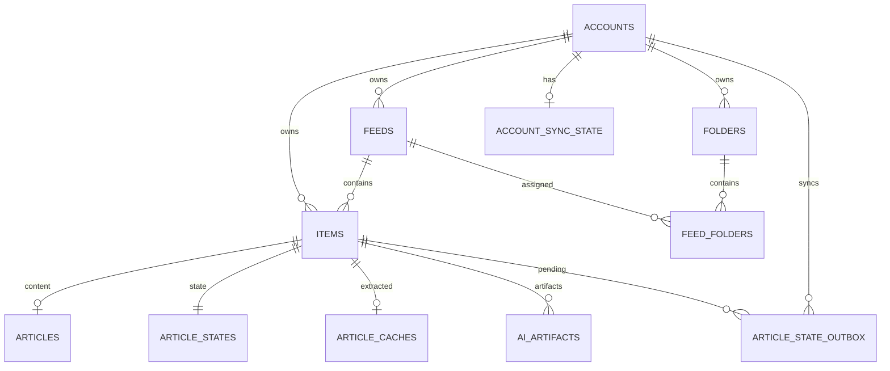

# PaperRss 数据层与多账号 / FreshRSS 架构优化实施规范

> **文档状态**：Accepted / Implementation Specification  
> **目标版本**：PaperRss Data Architecture v1  
> **适用范围**：`PaperRssCore`、本地持久化、多账号体系、FreshRSS（Google Reader API）接入  
> **主要读者**：PaperRss 开发人员、代码审查者、Coding Agent  
> **非目标**：CloudKit 上线、iCloud 同步、完整第三方 RSS 服务矩阵、首期 FreshRSS 订阅 CRUD  
> **最后更新**：2026-08-16

---

## 0. 执行摘要

本次架构优化解决两个关联问题：

1. 当前 PaperRss 使用单个 `library.json` 保存 Feed、文章、阅读状态、正文缓存和 AI 产物。任何细小写操作都需要形成并序列化完整 `AppDatabase` 快照；启动时也需要一次性加载整库。
2. FreshRSS 接入要求 PaperRss 从“单一本地 RSS 数据源”演进为“本地优先、多账号、可离线、可双向同步”的客户端。

本项目不是单纯的“JSON → SQLite”替换。目标架构为：

```text
SwiftUI / AppKit
       │
       ▼
 AppStore / ViewModel
       │
       ▼
 LibraryRepository
       │
       ▼
 ┌───────────────────────────────┐
 │        library.sqlite         │
 │           (GRDB)              │
 │                               │
 │ accounts                      │
 │ folders / feed_folders        │
 │ feeds                         │
 │ items                         │
 │ articles                      │
 │ article_states                │
 │ article_state_outbox          │
 │ article_caches                │
 │ ai_artifacts                  │
 │ account_sync_state            │
 └──────────────┬────────────────┘
                │
        SyncCoordinator
          ┌─────┴─────┐
          ▼           ▼
 LocalAccountProvider FreshRSSAccountProvider
          │           │
     FeedService   ReaderAPIClient
                      │
                   FreshRSS
```

核心技术决策：

- 使用 **SQLite + GRDB**，不自研 sqlite3 wrapper。
- 使用 **单个 `library.sqlite`**，而不是“每账号一个数据库”。
- 所有账号相关业务数据以 `account_id` 隔离。
- UI 不再持有完整 `AppDatabase`；数据通过 Repository 查询和 GRDB Observation 增量暴露。
- `AccountProvider` 只抽象当前真正需要的账号行为，不复制 NetNewsWire 巨型 `AccountDelegate`。
- 本地内部 ID 与 FreshRSS `external_id` 分离；远端 ID 永远按 opaque `TEXT` 处理。
- 文章拆分为 `items`（身份）、`articles`（内容）、`article_states`（动态状态）三层。
- FreshRSS 写回采用 **durable state outbox**，不是 append-only action queue。
- 对同一字段，如果本地存在 pending mutation，则同步 reconciliation 时 **pending local mutation 优先于 remote state**。
- FreshRSS API Password 必须进入真正的 macOS Keychain；数据库与 UserDefaults 不保存远端密码。
- **CloudKit 不进入本项目目标架构**。现有代码可保留，但不得影响新数据库设计与 FreshRSS 同步逻辑。

---

# 1. 背景与当前实现

## 1.1 当前持久化模型

PaperRss 当前 `AppDatabase` 同时包含：

- `Feed`
- `Entry`
- `ArticleCache`
- `ReadingState`
- `AIArtifact`
- `LLMConfiguration`
- `customFolders`

当前 `AppStore`：

- 在启动时读取 `Application Support/PaperRss/library.json`
- 将整个 `AppDatabase` 保持在内存
- 使用 `EntryLibraryIndex` 构造 Today / Unread / Starred / Feed / Folder 等派生索引
- 每次修改后形成完整数据库 snapshot
- 使用后台 actor 对完整 JSON 重新编码并原子写入磁盘

该方案在当前数据规模下可工作，但其复杂度随文章、正文 HTML、正文缓存和 AI 产物线性增长。

## 1.2 当前主要问题

### I/O 放大

例如“将一篇文章设为已读”最终仍会触发完整 `AppDatabase` 的编码与写回。

期望的新架构应只修改：

```sql
UPDATE article_states ...
```

以及远程账号需要时，同事务写入一条 outbox。

### 启动和内存开销

SQLite 改造的目标不是把 JSON 数据原样 SELECT 后重新组成一个巨大 `AppDatabase`。

**禁止以下伪迁移：**

```text
SQLite
  ↓
SELECT * FROM everything
  ↓
AppDatabase
  ↓
@Published database
```

否则只能解决全量 JSON 写盘问题，无法解决全量内存常驻和查询扩展性问题。

### 单账号假设

当前 `Feed` / `Entry` 无 Account 维度。FreshRSS 接入后必须表达：

```text
Local Account
FreshRSS Account A
FreshRSS Account B
...
```

并允许全局智能列表跨账号查询。

### 本地状态与远端状态冲突

FreshRSS 引入后，`read/starred` 不再只是本地属性，而是一个最终一致性问题：

```text
UI optimistic state
       ↓
SQLite durable state
       ↓
Outbox
       ↓
FreshRSS
       ↓
Remote reconciliation
```

---

# 2. 目标与非目标

## 2.1 本项目目标

### G1 — SQLite 化

用 SQLite 作为 PaperRss 阅读库唯一持久化数据库，并使用 GRDB 访问。

### G2 — Query-first 数据层

UI 只查询当前需要的数据：

- Feed 列表
- Folder 列表
- 智能列表计数
- 时间线第一页 / 后续页
- 单篇文章
- 单篇正文缓存
- 当前文章 AI 产物

不得通过完整数据库对象实现 UI。

### G3 — Account 数据模型

支持：

```text
Local
FreshRSS
```

并为后续其他远程 Provider 保留扩展空间。

### G4 — FreshRSS 双向状态同步

首期支持：

- 登录 / 认证
- Feed / Folder 拉取
- Article 拉取
- unread 状态同步
- starred 状态同步
- 本地离线修改
- 状态异步写回
- 失败自动重试
- 多次用户操作收敛

### G5 — 无损旧数据迁移

现有用户的：

- Feed UUID
- Entry ID
- 阅读状态
- ArticleCache
- AIArtifact
- custom folders
- LLM 非敏感配置

必须尽可能无损迁移。

### G6 — 可恢复性

任何单次同步失败不得破坏本地阅读。

任何数据库迁移失败不得删除原 `library.json`。

## 2.2 非目标

以下内容 **不属于本项目首期范围**：

- CloudKit / iCloud 正式上线
- FreshRSS 远端创建/删除/移动订阅
- FreshRSS 远端创建/删除/重命名 Folder
- Feedly / Feedbin / NewsBlur
- 跨设备 PaperRss AI Artifact 同步
- 全文搜索 FTS UI
- 新 Retention Policy 的自动删除上线
- 将所有 App Preferences 存进 SQLite
- 重写 RSS Parser / ArticleExtractor / LLMService

这些能力可以依赖本次架构，但不得扩大当前实施范围。

---

# 3. 架构不变量

以下规则属于本项目的 **Architecture Invariants**。员工和 Agent 不得自行绕过。

## INV-01 — 单数据库

PaperRss 使用：

```text
~/Library/Application Support/PaperRss/library.sqlite
```

所有账号共享该数据库。

不得为每个账号创建：

```text
Accounts/<ID>/database.sqlite
```

除非未来有新的 ADR 明确推翻本决策。

## INV-02 — Account 隔离必须存在于 Schema

所有 Feed、Folder、Item 和 Sync 数据必须可追溯至 `account_id`。

远程身份唯一性必须至少以：

```text
(account_id, external_id)
```

为边界。

## INV-03 — Remote ID 为 Opaque String

来自 FreshRSS / GReader 的：

- feed ID
- item ID
- tag / folder ID

不得假设为 Int、Int64 或固定前缀数字。

数据库字段统一使用：

```sql
TEXT
```

Transport 层可以规范化表示，但不得丢失远端原始身份语义。

## INV-04 — 内部 ID 与远端 ID 分离

例如：

```text
feeds.id          = PaperRss internal UUID
feeds.external_id = FreshRSS remote ID
```

不得将 FreshRSS ID 直接作为整个应用内部主键设计。

## INV-05 — Item Identity 与 Content / State 分离

允许：

```text
items             ✅
article_states    ✅
articles          ❌ 尚未下载
```

因此不能把“存在文章状态”与“已经存在文章内容”绑定为同一个表。

## INV-06 — Remote State Mutation 与 Outbox 同事务

对 FreshRSS 账号：

```text
更新 article_states
+
UPSERT article_state_outbox
```

必须发生在 **同一个 SQLite transaction**。

不得：

```text
先改 UI
→ 等网络成功
→ 再持久化
```

也不得：

```text
先持久化状态
→ transaction 外另写 outbox
```

## INV-07 — Pending Local Mutation 按字段覆盖 Remote

如果：

```text
item A
state_key = read
```

存在 pending outbox，则 remote unread/read reconciliation 不得覆盖本地 `read` 字段。

该优先级只作用于该字段，不应阻止同一文章的 `starred` 独立同步。

## INV-08 — Outbox 保存最终期望状态，不保存用户操作历史

不得使用：

```text
mark_read
mark_unread
mark_read
mark_unread
...
```

这种 append-only action queue。

只保存最终 desired state：

```text
item A / read / true
item A / starred / false
```

## INV-09 — View 不直接访问数据库

禁止：

```text
SwiftUI View
   ↓
DatabasePool
```

合法路径：

```text
View
 ↓
ViewModel / AppStore
 ↓
Repository
 ↓
Database
```

## INV-10 — 不再创建巨型 AppDatabase 常驻内存

迁移完成后，`AppDatabase` 不应继续作为运行期主数据库抽象。

如果迁移期间需要 legacy DTO，可以保留为：

```text
LegacyAppDatabase
```

仅用于 JSON decode / migration。

## INV-11 — 所有 Schema 变化必须通过 Migration

禁止运行时：

```sql
CREATE TABLE IF NOT EXISTS ...
```

散落在业务代码。

所有 schema evolution 统一由：

```swift
DatabaseMigrator
```

管理。

## INV-12 — Secrets 不进入 SQLite / UserDefaults

FreshRSS：

- API Password → Keychain
- Write token → memory
- Session/Auth token → 默认 memory；未来若需持久化也只能进入 Keychain

数据库可以保存：

- endpoint
- username
- account metadata

不得保存 password。

---

# 4. Source of Truth

这是实现同步逻辑时最重要的语义表。

| 数据 | Local Account | FreshRSS Account |
|---|---|---|
| Account metadata | SQLite | SQLite |
| Feed subscription | SQLite authoritative | FreshRSS authoritative；SQLite mirror/cache |
| Folder | SQLite authoritative | FreshRSS authoritative；SQLite mirror/cache |
| Feed HTTP validators | SQLite | 通常不适用客户端直抓 |
| Item identity | SQLite | FreshRSS authoritative identity；SQLite mirror |
| Article content | Feed/Web → SQLite | FreshRSS → SQLite |
| Read state | SQLite | SQLite optimistic + FreshRSS eventual truth |
| Starred state | SQLite | SQLite optimistic + FreshRSS eventual truth |
| Article extracted cache | SQLite | SQLite only |
| AI artifacts | SQLite | SQLite only |
| Translation memory | SQLite global | SQLite global |
| FreshRSS API password | — | Keychain |
| UI preferences | UserDefaults | UserDefaults |
| CloudKit | Not involved | Not involved |

### 4.1 “eventual truth”的具体定义

FreshRSS 账号的 read/starred 状态并不是简单的“服务器永远覆盖本地”。

规则：

```text
没有 pending local mutation
        ↓
remote authoritative

存在 pending local mutation
        ↓
local desired state 暂时优先
        ↓
push 成功
        ↓
清除 outbox
        ↓
下一轮 remote reconciliation 自然收敛
```

---

# 5. 技术选型

## 5.1 SQLite Layer

使用：

```text
GRDB.swift
```

必须使用其：

- `DatabasePool`
- `DatabaseMigrator`
- transaction
- `FetchableRecord`
- `PersistableRecord`
- `ValueObservation`
- prepared statements / query interfaces

### 不做

- 不自研 sqlite3 concurrency wrapper
- 不自研 migration framework
- 不自行实现数据库 observation
- 不使用 SwiftData 作为本项目主存储层

## 5.2 Journal Mode

使用 `DatabasePool`，数据库按 GRDB 推荐配置启用 WAL 并允许并发读取。

任何额外 PRAGMA 必须有基准或明确理由。

---

# 6. 推荐模块结构

目标文件结构建议：

```text
PaperRss/Sources/Core/
├── Accounts/
│   ├── Account.swift
│   ├── AccountManager.swift
│   ├── AccountProvider.swift
│   ├── AccountCapabilities.swift
│   ├── LocalAccountProvider.swift
│   └── FreshRSS/
│       ├── FreshRSSAccountProvider.swift
│       ├── ReaderAPIClient.swift
│       ├── ReaderAPIModels.swift
│       ├── ReaderAPIAuthenticator.swift
│       └── ReaderAPIEndpoint.swift
│
├── Persistence/
│   ├── LibraryDatabase.swift
│   ├── DatabaseMigrations.swift
│   ├── Records/
│   │   ├── AccountRecord.swift
│   │   ├── FolderRecord.swift
│   │   ├── FeedRecord.swift
│   │   ├── ItemRecord.swift
│   │   ├── ArticleRecord.swift
│   │   ├── ArticleStateRecord.swift
│   │   ├── ArticleStateOutboxRecord.swift
│   │   ├── ArticleCacheRecord.swift
│   │   ├── AIArtifactRecord.swift
│   │   └── AccountSyncStateRecord.swift
│   │
│   └── Repositories/
│       ├── AccountRepository.swift
│       ├── FeedRepository.swift
│       ├── ArticleRepository.swift
│       ├── ArticleStateRepository.swift
│       ├── CacheRepository.swift
│       └── AIArtifactRepository.swift
│
├── Sync/
│   ├── SyncCoordinator.swift
│   ├── ArticleStateOutboxProcessor.swift
│   └── SyncError.swift
│
├── Credentials/
│   ├── CredentialStore.swift
│   └── KeychainCredentialStore.swift
│
├── Legacy/
│   ├── LegacyAppDatabase.swift
│   └── LegacyJSONMigrator.swift
│
├── FeedService.swift
├── FeedParser.swift
├── ArticleExtractor.swift
├── LLMService.swift
└── ...
```

目录不是强制 API，但职责边界必须保持。

---

# 7. Account 抽象

## 7.1 Account

建议领域对象：

```swift
public struct Account: Identifiable, Sendable, Equatable {
    public let id: String
    public var type: AccountType
    public var displayName: String
    public var endpointURL: URL?
    public var username: String?
    public var isEnabled: Bool
}
```

```swift
public enum AccountType: String, Codable, Sendable {
    case local
    case freshRSS
}
```

`rawValue` 落盘后视为兼容协议，不得随意改名。

## 7.2 AccountProvider

首期保持最小协议面：

```swift
public protocol AccountProvider: Sendable {
    var accountID: String { get }

    func refresh(reason: RefreshReason) async throws -> RefreshResult
    func pushPendingArticleStates() async throws
}
```

订阅管理能力不要一开始塞进巨型 protocol。

未来使用：

```swift
AccountCapabilities
```

描述：

```text
canCreateFeed
canDeleteFeed
canMoveFeed
canCreateFolder
...
```

首期 FreshRSS 只要求数据拉取 + read/starred 写回。

---

# 8. Schema v1

所有日期统一使用：

```text
REAL (Unix timestamp)
```

所有 Bool 使用：

```text
INTEGER 0 / 1
```

应用层统一转换。

## 8.1 `accounts`

```sql
CREATE TABLE accounts (
    id              TEXT PRIMARY KEY NOT NULL,
    type            TEXT NOT NULL,
    display_name    TEXT NOT NULL,
    endpoint_url    TEXT,
    username        TEXT,
    is_enabled      INTEGER NOT NULL DEFAULT 1,
    created_at      REAL NOT NULL,
    updated_at      REAL NOT NULL,

    CHECK (type IN ('local', 'freshRSS'))
);

CREATE INDEX idx_accounts_type
ON accounts(type);
```

约束：

- 默认本地账号 ID 固定为：

```text
local-default
```

- App 首次迁移时必须创建。
- FreshRSS endpoint 应由 client 层 canonicalize 后保存。
- 数据库不保存密码。

## 8.2 `folders`

```sql
CREATE TABLE folders (
    id              TEXT PRIMARY KEY NOT NULL,
    account_id      TEXT NOT NULL,
    external_id     TEXT,
    name            TEXT NOT NULL,
    sort_order      INTEGER NOT NULL DEFAULT 0,
    is_deleted      INTEGER NOT NULL DEFAULT 0,
    updated_at      REAL NOT NULL,

    FOREIGN KEY(account_id)
        REFERENCES accounts(id)
        ON DELETE CASCADE
);

CREATE INDEX idx_folders_account
ON folders(account_id, is_deleted, sort_order, name);

CREATE UNIQUE INDEX idx_folders_remote_identity
ON folders(account_id, external_id)
WHERE external_id IS NOT NULL;
```

不要使用：

```sql
name TEXT PRIMARY KEY
```

Folder rename 不应改变 object identity。

## 8.3 `feeds`

```sql
CREATE TABLE feeds (
    id                  TEXT PRIMARY KEY NOT NULL,
    account_id          TEXT NOT NULL,
    external_id         TEXT,
    title               TEXT NOT NULL,
    site_url            TEXT,
    feed_url            TEXT NOT NULL,
    etag                TEXT,
    last_modified       TEXT,
    last_refreshed_at   REAL,
    is_deleted          INTEGER NOT NULL DEFAULT 0,
    updated_at          REAL NOT NULL,
    stored_icon_url     TEXT,
    sort_order          INTEGER NOT NULL DEFAULT 0,

    FOREIGN KEY(account_id)
        REFERENCES accounts(id)
        ON DELETE CASCADE
);

CREATE INDEX idx_feeds_account
ON feeds(account_id, is_deleted, sort_order, title);

CREATE INDEX idx_feeds_url
ON feeds(account_id, feed_url);

CREATE UNIQUE INDEX idx_feeds_remote_identity
ON feeds(account_id, external_id)
WHERE external_id IS NOT NULL;
```

### Local Account

`external_id` 可以使用当前已有稳定 Feed identity 或为空。

### FreshRSS

必须保存服务器返回的远端 feed identity。

## 8.4 `feed_folders`

```sql
CREATE TABLE feed_folders (
    feed_id     TEXT NOT NULL,
    folder_id   TEXT NOT NULL,

    PRIMARY KEY(feed_id, folder_id),

    FOREIGN KEY(feed_id)
        REFERENCES feeds(id)
        ON DELETE CASCADE,

    FOREIGN KEY(folder_id)
        REFERENCES folders(id)
        ON DELETE CASCADE
);

CREATE INDEX idx_feed_folders_folder
ON feed_folders(folder_id, feed_id);
```

底层允许一个 Feed 多 Folder。

即使 UI 首期只展示一个主 Folder，也不得重新把 schema 降级为 `feeds.folder TEXT`。

## 8.5 `items`

`items` 表示“文章身份已经被知道”。

```sql
CREATE TABLE items (
    id              TEXT PRIMARY KEY NOT NULL,
    account_id      TEXT NOT NULL,
    external_id     TEXT NOT NULL,
    feed_id         TEXT NOT NULL,
    created_at      REAL NOT NULL,
    updated_at      REAL NOT NULL,

    FOREIGN KEY(account_id)
        REFERENCES accounts(id)
        ON DELETE CASCADE,

    FOREIGN KEY(feed_id)
        REFERENCES feeds(id)
        ON DELETE CASCADE
);

CREATE UNIQUE INDEX idx_items_remote_identity
ON items(account_id, external_id);

CREATE INDEX idx_items_feed
ON items(feed_id);
```

### 语义

FreshRSS 可以先返回一个 unread item ID：

```text
items             ✅
article_states    ✅
articles          ❌
```

之后再批量获取全文并填入 `articles`。

## 8.6 `articles`

```sql
CREATE TABLE articles (
    item_id          TEXT PRIMARY KEY NOT NULL,
    title            TEXT NOT NULL,
    author           TEXT,
    url              TEXT,
    published_at     REAL,
    summary          TEXT NOT NULL DEFAULT '',
    content_html     TEXT,
    content_updated_at REAL NOT NULL,

    FOREIGN KEY(item_id)
        REFERENCES items(id)
        ON DELETE CASCADE
);

CREATE INDEX idx_articles_published
ON articles(published_at DESC);
```

文章内容不要存：

- read
- starred
- extracted article cache
- AI result

## 8.7 `article_states`

```sql
CREATE TABLE article_states (
    item_id          TEXT PRIMARY KEY NOT NULL,
    is_read          INTEGER NOT NULL DEFAULT 0,
    is_starred       INTEGER NOT NULL DEFAULT 0,
    date_arrived     REAL NOT NULL,
    updated_at       REAL NOT NULL,

    FOREIGN KEY(item_id)
        REFERENCES items(id)
        ON DELETE CASCADE
);

CREATE INDEX idx_article_states_unread
ON article_states(is_read, item_id);

CREATE INDEX idx_article_states_starred
ON article_states(is_starred, item_id);
```

### 唯一状态源

迁移后：

```text
article_states
```

是 read/starred 唯一 source of truth。

不得继续在 `Article` / `Entry` 中保留第二份持久状态。

UI DTO 可以投影：

```swift
ArticleListItem.isRead
```

但它是 query projection，不是第二份持久状态。

---

# 9. Durable Article State Outbox

## 9.1 Schema

```sql
CREATE TABLE article_state_outbox (
    account_id          TEXT NOT NULL,
    item_id             TEXT NOT NULL,
    state_key           TEXT NOT NULL,
    desired_value       INTEGER NOT NULL,
    revision            INTEGER NOT NULL DEFAULT 1,
    updated_at          REAL NOT NULL,
    attempt_count       INTEGER NOT NULL DEFAULT 0,
    next_attempt_at     REAL,
    last_error          TEXT,

    PRIMARY KEY(account_id, item_id, state_key),

    FOREIGN KEY(account_id)
        REFERENCES accounts(id)
        ON DELETE CASCADE,

    FOREIGN KEY(item_id)
        REFERENCES items(id)
        ON DELETE CASCADE,

    CHECK(state_key IN ('read', 'starred'))
);

CREATE INDEX idx_article_state_outbox_ready
ON article_state_outbox(account_id, next_attempt_at, updated_at);
```

## 9.2 写入算法

用户将 FreshRSS 文章设为已读：

```text
BEGIN TRANSACTION

UPDATE article_states
SET
  is_read = 1,
  updated_at = now
WHERE item_id = ?

UPSERT article_state_outbox
  (account_id, item_id, state_key='read')
SET
  desired_value = 1,
  revision = revision + 1,
  updated_at = now,
  attempt_count = 0,
  next_attempt_at = NULL,
  last_error = NULL

COMMIT
```

UI 通过数据库 observation 立即更新。

网络请求不属于该 transaction。

## 9.3 为什么使用 State Outbox

以下操作：

```text
read
unread
read
unread
read
```

最终数据库只保存：

```text
read = true
```

而不是五条 action。

这可以避免：

- 队列无限增长
- 顺序恢复复杂
- 重试重复
- 用户快速操作导致远端抖动

## 9.4 In-flight Race

发送请求前读取：

```text
item_id
state_key
desired_value
revision = N
```

FreshRSS 返回成功后只允许：

```sql
DELETE FROM article_state_outbox
WHERE
    item_id = ?
    AND state_key = ?
    AND revision = N;
```

如果请求期间用户又修改了状态：

```text
revision = N + 1
```

旧请求成功也不会误删新 desired state。

这是必须有单元测试覆盖的竞态。

## 9.5 Retry

网络失败：

```text
attempt_count += 1
next_attempt_at = exponentialBackoff(...)
last_error = sanitizedMessage
```

建议：

```text
1m → 2m → 5m → 15m → 30m → 1h
```

达到 1h 后可维持 1h 或由用户手动刷新立即重试。

禁止无限高速重试。

---

# 10. `article_caches`

```sql
CREATE TABLE article_caches (
    item_id             TEXT PRIMARY KEY NOT NULL,
    text                TEXT NOT NULL,
    html                TEXT,
    image_urls_json     TEXT,
    fetched_at          REAL NOT NULL,
    source_url          TEXT,
    is_sanitized        INTEGER NOT NULL DEFAULT 0,

    FOREIGN KEY(item_id)
        REFERENCES items(id)
        ON DELETE CASCADE
);
```

正文提取缓存仍属于 PaperRss 本地能力，不参与 FreshRSS 同步。

`image_urls_json` 首期可以继续 JSON 存储，因为它是单个 cache row 内的小型 value object，不属于需要关系查询的数据。

---

# 11. `ai_artifacts`

AIArtifact 有两类：

1. article-scoped artifact
2. global translation memory

因此不能简单要求所有 Artifact 强制 FK 到 item。

建议：

```sql
CREATE TABLE ai_artifacts (
    id                      TEXT PRIMARY KEY NOT NULL,
    account_id              TEXT,
    item_id                 TEXT,
    subject_key             TEXT NOT NULL,
    kind                    TEXT NOT NULL,
    content_hash            TEXT NOT NULL,
    model                   TEXT NOT NULL,
    target_language         TEXT NOT NULL,
    prompt_version          INTEGER NOT NULL DEFAULT 1,
    content                 TEXT NOT NULL DEFAULT '',
    segments_json           TEXT,
    selection_text          TEXT,
    selection_article_hash  TEXT,
    selection_anchor_json   TEXT,
    is_complete             INTEGER NOT NULL DEFAULT 0,
    is_deleted              INTEGER NOT NULL DEFAULT 0,
    created_at              REAL NOT NULL,
    updated_at              REAL NOT NULL,

    FOREIGN KEY(account_id)
        REFERENCES accounts(id)
        ON DELETE CASCADE,

    FOREIGN KEY(item_id)
        REFERENCES items(id)
        ON DELETE SET NULL
);

CREATE INDEX idx_ai_artifacts_article_lookup
ON ai_artifacts(item_id, kind, content_hash, updated_at DESC);

CREATE INDEX idx_ai_artifacts_subject_lookup
ON ai_artifacts(subject_key, kind, content_hash, updated_at DESC);
```

### Normal article artifact

```text
account_id  = owning account
item_id     = article item ID
subject_key = item ID
```

### Translation memory

```text
account_id  = NULL
item_id     = NULL
subject_key = existing translation-memory key
```

Translation memory 继续允许跨文章和跨账号复用。

---

# 12. `account_sync_state`

```sql
CREATE TABLE account_sync_state (
    account_id                  TEXT PRIMARY KEY NOT NULL,
    initial_sync_completed      INTEGER NOT NULL DEFAULT 0,
    last_sync_started_at        REAL,
    last_sync_completed_at      REAL,
    last_full_reconcile_at      REAL,
    last_article_fetch_at       REAL,
    consecutive_failure_count   INTEGER NOT NULL DEFAULT 0,
    last_error                  TEXT,

    FOREIGN KEY(account_id)
        REFERENCES accounts(id)
        ON DELETE CASCADE
);
```

不要把 API Password、Auth Token 或 write token 放在这里。

---

# 13. Repository API

Repository 的目标是把 SQL 与业务层隔离，同时避免重新创建巨型数据库对象。

建议最小接口。

## 13.1 AccountRepository

```swift
func accounts() async throws -> [Account]
func observeAccounts() -> ValueObservation<[Account]>
func createFreshRSSAccount(...) async throws -> Account
func deleteAccount(id: String) async throws
```

删除账号必须依赖 FK cascade 清理：

- folders
- feeds
- items
- article states
- article content
- cache
- article-scoped AI artifact
- outbox
- sync state

Global translation memory 不删除。

## 13.2 FeedRepository

```swift
func feeds(accountID: String?) async throws -> [FeedSummary]
func observeSidebar() -> ValueObservation<SidebarSnapshot>
func upsertRemoteFeeds(...) async throws
func upsertFolders(...) async throws
```

## 13.3 ArticleRepository

```swift
enum ArticleScope {
    case all
    case today
    case unread
    case starred
    case account(String)
    case feed(String)
    case folder(String)
}
```

```swift
func articles(
    scope: ArticleScope,
    limit: Int,
    offset: Int
) async throws -> [ArticleListItem]

func observeArticles(
    scope: ArticleScope,
    limit: Int
) -> ValueObservation<[ArticleListItem]>

func article(itemID: String) async throws -> ArticleDetail?
```

首屏默认：

```text
limit = 100
```

禁止 timeline 首次加载直接 SELECT 全库。

## 13.4 ArticleStateRepository

```swift
func setRead(itemID: String, value: Bool) async throws
func setStarred(itemID: String, value: Bool) async throws
```

Repository 内部根据 Account Type 判断：

### Local

只改 `article_states`。

### FreshRSS

同 transaction：

```text
article_states
+
article_state_outbox
```

View / AppStore 不负责判断是否应该写 outbox。

---

# 14. AppStore 重构

## 14.1 目标

当前：

```text
AppStore
 ├ database
 ├ persistence
 ├ index
 ├ feed refresh
 ├ cache
 ├ AI
 └ cloud sync
```

目标：

```text
AppStore
 ├ UI workflow state
 ├ refresh orchestration
 ├ AI task UI state
 └ repository/provider composition
```

## 14.2 删除的运行期模式

最终必须移除：

```swift
@Published public private(set) var database: AppDatabase
```

以及依赖它构造完整：

```text
EntryLibraryIndex
```

的主数据路径。

短期迁移阶段允许同时存在 legacy adapter，但不能成为最终实现。

## 14.3 Observation

建议用 GRDB：

```text
ValueObservation
```

驱动：

- sidebar counts
- feed list
- current timeline
- current article state
- AI artifact changes

AppStore / ViewModel 负责订阅并转换为 `@Published` UI state。

---

# 15. FreshRSS CredentialStore

## 15.1 当前问题

现有 `KeychainStore.swift` 实际使用 UserDefaults，并非系统 Keychain。

该实现不得用于 FreshRSS password。

## 15.2 新接口

```swift
public protocol CredentialStore: Sendable {
    func freshRSSPassword(accountID: String) throws -> String?
    func saveFreshRSSPassword(
        _ password: String,
        accountID: String
    ) throws
    func deleteFreshRSSCredentials(
        accountID: String
    ) throws
}
```

实现：

```text
KeychainCredentialStore
```

使用 `Security.framework`：

- `SecItemAdd`
- `SecItemCopyMatching`
- `SecItemUpdate`
- `SecItemDelete`

建议 service：

```text
com.paperrss.freshrss
```

account：

```text
<PaperRss account id>
```

## 15.3 Token 生命周期

### API Password

Keychain durable。

### ClientLogin Auth token

首期允许只存在内存。

App 启动时可以重新 ClientLogin。

未来若需要减少登录次数，可通过新 ADR 决定是否持久化 Keychain。

### `/reader/api/0/token`

只存在内存。

过期或 401 后重新获取。

---

# 16. FreshRSS ReaderAPIClient

Transport 层只负责：

- request construction
- auth header
- endpoint normalization
- HTTP status
- response decoding
- Reader API data model

不得直接写数据库。

推荐：

```swift
actor ReaderAPIClient
```

## 16.1 Base URL Canonicalization

用户允许输入：

```text
https://rss.example.com
https://rss.example.com/
https://rss.example.com/api/greader.php
https://rss.example.com/freshrss/
https://rss.example.com/freshrss/api/greader.php
```

必须通过单一 canonicalization 逻辑得到 Reader API endpoint。

不得在各个 endpoint 方法里拼接不同规则。

## 16.2 核心端点

首期至少：

```text
/accounts/ClientLogin
/reader/api/0/token
/reader/api/0/subscription/list
/reader/api/0/tag/list
/reader/api/0/stream/items/ids
/reader/api/0/stream/items/contents
/reader/api/0/edit-tag
```

如果真实 FreshRSS 兼容性验证发现某 endpoint 需要 variant 处理，应集中到 `ReaderAPIClient` / `FreshRSSVariant`，不得污染 Repository。

---

# 17. FreshRSS 同步算法

## 17.1 同步总序

日常 refresh 建议：

```text
1. Validate account / auth if needed

2. Push pending article states
   ↓
   Drain outbox as far as possible

3. Pull subscriptions / folders
   ↓
   Upsert SQLite mirror

4. Pull unread IDs
5. Pull starred IDs

6. Reconcile remote state
   ↓
   EXCLUDE fields with pending local mutations

7. Determine missing item contents

8. Fetch missing articles in batches

9. Commit account_sync_state success
```

如果 push 失败：

- 不应阻止用户读取本地数据库
- 是否继续 pull 由错误类型决定
- 普通网络失败可结束本轮同步
- 单个 outbox request 失败不得删除 outbox

## 17.2 Initial Sync

首次添加 FreshRSS：

```text
Account metadata transaction
↓
Save password to Keychain
↓
ClientLogin validation
↓
subscriptions + folders
↓
unread ID set
↓
starred ID set
↓
create item identities
↓
create article_states
↓
fetch missing contents in batches
↓
initial_sync_completed = true
```

Account 创建与 Credential 保存若中途失败必须清理半成品。

## 17.3 State Reconciliation

设：

```text
RU = remote unread IDs
RS = remote starred IDs
LU = local unread IDs
LS = local starred IDs
PU = pending read mutations
PS = pending starred mutations
```

Remote 可以更新：

```text
all item IDs - PU
```

的 read state。

Remote 可以更新：

```text
all item IDs - PS
```

的 starred state。

### 示例

Server：

```text
A = unread
```

Local：

```text
A = read
outbox: A/read=true
```

Pull 时：

```text
A ∈ PU
```

所以 remote unread 不覆盖本地 read。

## 17.4 内容缺失

同步得到 remote item identity 后：

```sql
SELECT items.id
FROM items
LEFT JOIN articles ON articles.item_id = items.id
WHERE
    items.account_id = ?
    AND articles.item_id IS NULL;
```

只对缺失文章请求 `stream/items/contents`。

不得每次同步重新下载完整文章库。

---

# 18. 本地 Local Account

`LocalAccountProvider` 继续复用现有：

- `FeedService`
- `FeedParser`
- ETag
- Last-Modified
- ArticleExtractor

但数据写入 Repository / SQLite。

Local Account：

```text
Feed / Folder / Item / State
```

完全由本地 SQLite authoritative。

没有 outbox。

---

# 19. JSON → SQLite Migration

## 19.1 原则

- 不双写 JSON 和 SQLite
- 不删除旧 JSON
- 单 transaction 导入
- 验证成功后一次性 cutover
- 失败时原 JSON 必须保持原样
- 迁移必须可重复测试

## 19.2 启动检测

条件：

```text
library.json exists
AND
library.sqlite 不存在已完成 v1 import
```

执行 migration。

## 19.3 Migration 预备

1. 复制：

```text
library.json
↓
library.json.pre-sqlite-<timestamp>.backup
```

2. 初始化 SQLite v1 schema。
3. 开始 transaction。
4. 创建：

```text
accounts.id = local-default
type = local
```

## 19.4 Feed 迁移

保持现有：

```text
Feed.id
```

不变。

映射：

```text
account_id  = local-default
external_id = NULL
```

旧：

```text
Feed.folder
```

转换：

```text
folders
+
feed_folders
```

同时合并：

```text
customFolders
```

避免重复 Folder。

## 19.5 Entry 迁移

保持现有：

```text
Entry.id
```

作为：

```text
items.id
```

为兼容和去重，Local legacy migration：

```text
items.external_id = Entry.id
```

写入：

```text
items
articles
article_states
```

### 状态优先级

如果 `readingStates[entryID]` 存在：

```text
ReadingState
```

优先于 Entry 内的：

```text
isRead
isStarred
```

如果不存在，则 fallback 到 Entry。

### `date_arrived`

旧模型没有可靠 arrival timestamp。

迁移时：

```text
date_arrived = migration time
```

不要用 `ReadingState.updatedAt` 当 arrival。

这样后续新增 retention policy 时不会在迁移后立即误删大量 legacy data。

## 19.6 ArticleCache 迁移

旧：

```text
articleCaches[entryID]
```

转为：

```text
article_caches.item_id = entryID
```

## 19.7 AIArtifact 迁移

如果：

```text
AIArtifact.entryID
```

匹配一个现有 Item：

```text
item_id = entryID
subject_key = entryID
account_id = local-default
```

否则视为 global/synthetic artifact：

```text
item_id = NULL
subject_key = original entryID
account_id = NULL
```

这样可保留当前 translation memory 语义。

## 19.8 LLM Configuration

非敏感 LLM 配置从 legacy JSON 迁移到新的 app configuration storage。

首期推荐：

```text
UserDefaults / Codable preferences
```

API Key 迁移不属于本项目数据库 migration；如果后续迁移到真正 Keychain，单独提交。

## 19.9 Migration 验证

transaction commit 前必须验证：

```text
legacy feeds count
== migrated active/deleted feeds count

legacy entries count
== items count
== articles count

legacy article cache count
== article_caches count
```

AI Artifact 允许因 legacy invalid/tombstone 特殊情况做专门断言，但不能静默丢失。

完成后：

```text
COMMIT
```

SQLite 成为唯一 authoritative store。

旧 JSON 保留但停止写入。

不得靠单独的：

```text
library_migrated.flag
```

作为真相源。

migration/version 信息由 SQLite schema / metadata 自身记录。

---

# 20. CloudKit 处理

当前无 Apple Developer 账号，CloudKit 功能未正式上线。

本项目：

- 不删除 `CloudSyncService.swift`
- 不扩展 CloudKit
- 不设计 SQLite ↔ CloudKit 同步
- 不让 CloudKit 决定 schema
- 不让 FreshRSS mirrored state 同时进入 CloudKit

如果现有 UI 暴露未上线 iCloud 开关，可继续维持当前禁用/实验状态。

未来若重新启动 CloudKit 项目，必须作为单独 ADR 设计：

```text
哪些数据归 CloudKit
哪些数据归 FreshRSS
如何避免双 remote source of truth
```

---

# 21. 错误恢复

## 21.1 Database Migration Failure

必须：

- 原 JSON 不删除
- backup 保留
- SQLite transaction rollback
- 用户数据不得进入半迁移状态
- 记录可诊断错误

不得创建空 DB 然后继续运行并让用户误以为数据丢失。

## 21.2 FreshRSS Network Failure

本地阅读必须继续工作。

显示：

```text
Last sync failed
```

但不要：

- 清空 Feed
- 清空 Article
- 清空 unread
- 清空 outbox

## 21.3 Auth Failure

401 / credential invalid：

```text
account sync error
```

保留 SQLite cache。

停止自动高频重试。

允许用户重新输入 API Password。

## 21.4 Partial Content Failure

一批 article content 下载失败：

- 已成功批次保留
- 缺失 Item 继续保持 Item + State
- 下次同步继续补齐
- 不回滚整个账号

---

# 22. 日志与可观测性

建立统一 subsystem：

```text
com.paperrss.persistence
com.paperrss.sync
com.paperrss.freshrss
com.paperrss.migration
```

推荐使用 `os.Logger`。

### 可以记录

```text
account ID
provider type
request endpoint path
HTTP status
batch size
duration
items inserted
states reconciled
outbox count
migration row counts
```

### 不得记录

```text
API password
Auth token
write token
Authorization header
完整文章正文
AI private content
```

---

# 23. 性能目标

以下为本项目的工程 benchmark target，不是产品 SLA。

测试数据集至少：

```text
100 feeds
50,000 items
50,000 article states
40,000 article bodies
10,000 unread
5,000 starred
5,000 AI artifacts
```

## P1 — 启动

启动不得 decode / materialize 全部文章正文。

## P2 — Timeline

打开 unread / feed：

```text
首批 ≤ 100 rows
```

不得先读取全库再 Swift sort/filter。

## P3 — Read Toggle

单篇已读修改只产生：

- state row update
- FreshRSS 时 outbox UPSERT

不得出现整库序列化或整文件 rewrite。

## P4 — Refresh

新文章 merge 应以 SQLite UPSERT / indexed lookup 实现。

禁止 O(n × m) 的全库 Swift `firstIndex(where:)` merge。

## P5 — Memory

正文 HTML 和 AI 内容按当前文章 / 当前 query 读取。

不得为 sidebar / timeline 常驻全部 content HTML。

---

# 24. 测试计划

## 24.1 Database Migration Tests

必须覆盖：

- 空 JSON
- 正常 legacy library
- custom folders
- deleted feed
- readingStates 存在
- readingStates 缺失 fallback
- article cache
- article-scoped AI artifact
- translation memory synthetic artifact
- migration 重试
- migration 中途抛错 transaction rollback
- backup 不丢失

## 24.2 Repository Tests

至少：

```text
insert/update feed
folder association
multi-folder feed
timeline pagination
unread query
starred query
account filtering
cross-account query
account delete cascade
```

## 24.3 Article State Transaction Tests

Local：

```text
state update
outbox = none
```

FreshRSS：

```text
state update + outbox
atomic
```

必须人工制造 transaction error 验证：

```text
两者同时 commit
或
两者同时 rollback
```

## 24.4 Outbox Tests

覆盖：

```text
read → unread → read
最终只有一行 desired=true

starred 与 read 相互独立

request in-flight
→ user changes state
→ old success 不删除新 revision

network fail
→ row remains

retry
→ success deletes exact revision
```

## 24.5 Reconciliation Tests

覆盖：

```text
remote unread + no local pending
→ local unread

remote unread + local pending read=true
→ local remains read

remote unstarred + local pending starred=true
→ local remains starred

pending read
不阻止 remote 更新 starred
```

## 24.6 Reader API Tests

通过 custom `URLProtocol` / mock transport 测试：

- ClientLogin plain-text response
- malformed Auth
- 401
- token refresh
- subscription decode
- item IDs decode
- continuation pagination
- batch content
- edit-tag
- remote opaque String IDs
- unusual base URL / subdirectory

## 24.7 Integration Test

如果开发环境有 FreshRSS：

使用环境变量：

```text
PAPERRSS_TEST_FRESHRSS_URL
PAPERRSS_TEST_FRESHRSS_USER
PAPERRSS_TEST_FRESHRSS_PASSWORD
```

凭据不得提交 Git。

CI 默认不要求真实服务器。

---

# 25. 分阶段实施

## Phase 0 — Baseline 与 Feature Boundary

### 工作

- 锁定当前 JSON 行为测试
- 建立 migration fixtures
- 记录当前 Feed / Entry / Cache / AIArtifact 语义
- 确认 CloudKit 不在范围
- 确认首期 FreshRSS 不做 subscription CRUD

### Acceptance Criteria

- 当前 `swift test` 通过
- migration fixture 可重复构造
- 本规范进入 repo 并被团队接受

## Phase 1 — GRDB 与 SQLite Core

### 工作

- 添加 GRDB dependency
- 建立 `LibraryDatabase`
- 建立 v1 migrations
- 建立 Records
- 建立基础 Repositories
- 写 schema tests

### 不做

- 不改 UI
- 不接 FreshRSS
- 不删除 JSON

### Acceptance Criteria

- 空库可创建
- migration version 可重复打开
- FK 开启
- WAL / DatabasePool 工作
- Repository 单测通过

## Phase 2 — Legacy JSON Migration

### 工作

- 创建 `LegacyAppDatabase`
- 实现 `LegacyJSONMigrator`
- 数据 backup
- transaction import
- counts validation
- 切换 SQLite authoritative store

### Acceptance Criteria

同一 legacy fixture：

```text
feeds count      100%
entries/items    100%
article states   100%
article caches   100%
AI artifacts     100%（除明确 invalid fixture）
```

旧 ID 保持稳定。

迁移失败原 JSON 完整。

## Phase 3 — Local Account Read/Write Cutover

### 工作

- 创建 `local-default`
- AppStore / ViewModel 改为 Repository
- sidebar observation
- article timeline pagination
- read/starred mutation
- Feed refresh 写 SQLite
- ArticleCache 写 SQLite
- AIArtifact 写 SQLite

### Acceptance Criteria

- 正常本地阅读不再依赖 `AppDatabase`
- 不再写 `library.json`
- Feed refresh 正常
- 已读/收藏正常
- Reader 正文与 AI 功能正常
- UI 不直接使用 DatabasePool
- 启动不加载所有 Article HTML

## Phase 4 — Account Abstraction

### 工作

- `Account`
- `AccountType`
- `AccountManager`
- `AccountProvider`
- `LocalAccountProvider`
- sidebar Account grouping
- global smart views

### Acceptance Criteria

即使只有 Local：

```text
Account abstraction
```

完整工作。

Global unread query 必须通过单 SQLite query / repository path 支持未来多账号。

## Phase 5 — CredentialStore + ReaderAPIClient

### 工作

- KeychainCredentialStore
- FreshRSS account form
- base URL canonicalization
- ClientLogin
- token
- subscription/tag/item/content/edit-tag endpoints
- mock transport tests

### Acceptance Criteria

- 密码不进入 SQLite
- 密码不进入 UserDefaults
- 日志无 secret
- 测试服务器可验证登录
- opaque remote ID 不发生 numeric conversion

## Phase 6 — FreshRSS Pull Sync

### 工作

- FreshRSSAccountProvider
- account sync state
- subscriptions/folders mirror
- unread/starred ID pull
- item identity creation
- state reconciliation
- missing content batches

### Acceptance Criteria

首次连接可以：

```text
显示 FreshRSS feeds
显示 folders
显示文章
显示 unread
显示 starred
```

断网重启后仍可阅读已有 SQLite cache。

## Phase 7 — Durable State Push

### 工作

- article_state_outbox
- FreshRSS article state mutation transaction
- processor
- edit-tag batching
- retry/backoff
- revision race protection
- pending-local reconciliation protection

### Acceptance Criteria

真实或 mock FreshRSS：

```text
offline mark read
→ UI immediately read
→ app restart
→ outbox still exists
→ reconnect
→ server becomes read
→ outbox cleared
```

快速 toggle：

```text
read/unread/read
```

最终 server 与最后本地状态一致。

## Phase 8 — Stabilization / Removal

### 工作

- 删除运行期 AppDatabase 依赖
- 删除 JSON writer
- 清理旧 EntryLibraryIndex 路径
- database indexes benchmark
- account delete / credential cleanup
- end-to-end regression

### Acceptance Criteria

代码搜索不得存在新的：

```text
library.json write
@Published AppDatabase
View → DatabasePool
FreshRSS password → UserDefaults
```

所有测试通过。

---

# 26. 建议拆分的开发任务

为了降低 Agent 一次改动范围，建议拆成以下 issue / PR：

### DA-01 — Add GRDB and LibraryDatabase
只增加 dependency、DB bootstrap、migration harness。

### DA-02 — Schema v1
实现本规范所有 v1 tables / indexes。

### DA-03 — Persistence Records and Repositories
先不改 AppStore。

### DA-04 — Legacy JSON Migration
fixture + backup + transaction import。

### DA-05 — Local Feed Repository Cutover
Feed / Folder 数据转 SQLite。

### DA-06 — Article and State Cutover
Items / Articles / ArticleState。

### DA-07 — Cache and AI Artifact Cutover
ArticleCache / AIArtifact。

### DA-08 — Replace EntryLibraryIndex Read Path
Timeline / counts / pagination / observation。

### DA-09 — Account Model and LocalAccountProvider
引入 AccountManager。

### FR-01 — Real Keychain CredentialStore
与现有 LocalAPIKeyStore 分离。

### FR-02 — ReaderAPI Transport and Authentication
ClientLogin + token + endpoint canonicalization。

### FR-03 — FreshRSS Subscription / Folder Pull
只读 mirror。

### FR-04 — FreshRSS Item ID and Content Pull
Items → Articles。

### FR-05 — Remote State Reconciliation
unread / starred。

### FR-06 — Durable State Outbox
事务、revision、retry。

### FR-07 — FreshRSS Account UI
添加 / 删除 / 重新认证 / 同步状态。

### FR-08 — End-to-End FreshRSS Validation
真实服务回归。

不要把 DA-01 ~ FR-08 放进一个 PR。

---

# 27. Agent 开发规则

交给 Coding Agent 时，将本节作为强约束。

## Rule A — 每个任务先读

至少阅读：

```text
docs/technical/本规范
PaperRss/Sources/Core/AppStore.swift
PaperRss/Sources/Core/Models.swift
相关 Repository / Provider
Tests/
```

涉及 FreshRSS 时同时阅读：

```text
docs/research/freshrss-api-research.md
docs/research/netnewswire-account-system-and-greader.md
```

## Rule B — 不擅自重新设计 Scope

Agent 不得自行：

- 引入 SwiftData 替换 GRDB
- 改为每账号一个 SQLite
- 恢复 JSON 做主存储
- 把 CloudKit 接入新同步架构
- 首期增加 Feedly/NewsBlur
- 为 FreshRSS 增加密码明文存储
- 把 remote ID 改为 Int64

如果认为规范错误，必须先提出 ADR / issue，不得在实现 PR 中悄悄改变。

## Rule C — 小 PR

单个 PR 尽量只实现一个任务。

例如：

```text
“Schema + Migration + FreshRSS + UI”
```

属于不可接受的大范围 PR。

## Rule D — Schema First

任何需要新增字段：

```text
migration
↓
record
↓
repository
↓
business
↓
UI
```

禁止 UI / model 先假设字段存在。

## Rule E — 写测试再修改同步核心

以下逻辑必须有测试：

- migration
- outbox
- reconciliation
- account delete cascade
- credential redaction
- remote ID parsing

## Rule F — 禁止 silent data loss

任何 cleanup：

```text
DELETE
purge
retention
migration drop
```

必须有明确测试和范围说明。

---

# 28. Code Review Checklist

每个相关 PR Reviewer 至少检查：

### Persistence

- [ ] 是否通过 GRDB migration 修改 schema？
- [ ] 是否启用 FK 并正确 cascade？
- [ ] 是否出现全库 SELECT 后内存 filter？
- [ ] 是否把 HTML / AI content 不必要地带入列表 query？
- [ ] 是否破坏 existing stable IDs？

### Account

- [ ] 新数据是否带 account dimension？
- [ ] remote identity 是否使用 `TEXT`？
- [ ] 是否混淆 internal ID / external ID？

### Sync

- [ ] remote mutation 是否 state + outbox 同事务？
- [ ] pending local mutation 是否能挡住 remote overwrite？
- [ ] outbox 是否覆盖最终状态而非追加 action？
- [ ] in-flight success 是否按 revision 删除？
- [ ] retry 是否 bounded/backoff？

### Security

- [ ] password 是否只进入 Keychain？
- [ ] log 是否泄漏 token/password/header？
- [ ] SQLite 是否无 secret？

### UI

- [ ] View 是否绕过 Repository？
- [ ] timeline 是否分页？
- [ ] sidebar 是否只查询必要 projection？

---

# 29. Definition of Done

本架构优化只有满足以下条件才算完成：

1. PaperRss 正常运行不再依赖 `library.json` 作为主库。
2. `library.sqlite` 为唯一 authoritative local database。
3. 旧用户数据可自动迁移且保留 backup。
4. AppStore 不再常驻完整 AppDatabase。
5. Local Account 行为与迁移前一致。
6. 可以添加至少一个 FreshRSS Account。
7. FreshRSS subscriptions/folders/articles 可以离线读取。
8. unread/starred 双向同步。
9. 离线 read/starred 操作跨重启不丢失。
10. pending local mutation 不会被 remote pull 覆盖。
11. FreshRSS password 使用真正的 macOS Keychain。
12. CloudKit 不参与本项目新数据路径。
13. 所有 schema change 都由 GRDB migration 管理。
14. `swift test` 与相关 Node tests 通过。
15. 数据层和同步层关键行为有新增单元测试。

---

# 30. 后续能力

完成本规范后，可基于同一架构继续：

```text
FreshRSS subscription CRUD
FreshRSS folder CRUD
Inoreader / BazQux / The Old Reader
FTS5 full-text search
Retention Policy
后台同步调度
更多 AccountProvider
CloudKit（需独立 ADR）
```

这些能力不得反向污染 v1 的核心边界：

```text
single SQLite
account dimension
repository query model
opaque remote IDs
durable outbox
local-first UX
```

---

# Appendix A — 数据关系图



---

# Appendix B — FreshRSS 状态写回示例

```text
User clicks "Mark Read"
        │
        ▼
ArticleStateRepository.setRead()
        │
        ▼
┌────────────────────────────┐
│ SQLite Transaction         │
│                            │
│ UPDATE article_states      │
│ UPSERT outbox(read=true)   │
└──────────────┬─────────────┘
               │ COMMIT
               ▼
     UI observation updates
               │
               ▼
     OutboxProcessor wakes
               │
               ▼
  ReaderAPI /token if needed
               │
               ▼
       POST edit-tag
               │
          ┌────┴────┐
          │         │
       success    failure
          │         │
          ▼         ▼
 DELETE exact   keep row
 revision row   backoff retry
```

---

# Appendix C — Remote Reconciliation 示例

```text
FreshRSS says:
A = unread

SQLite says:
A = read

Outbox says:
A/read = true
```

处理：

```text
pending read exists
        ↓
do not apply remote unread
        ↓
push local read
        ↓
success
        ↓
delete matching outbox revision
        ↓
next sync sees remote read
        ↓
converged
```

这是 FreshRSS 离线优先体验必须长期保持的行为。

---

# Appendix D — 本规范依据的当前代码与调研

实现前应对照以下仓库内容：

- `PaperRss/Sources/Core/AppStore.swift`
- `PaperRss/Sources/Core/Models.swift`
- `PaperRss/Sources/Core/CloudSyncService.swift`
- `PaperRss/Sources/Core/KeychainStore.swift`
- `Package.swift`
- `docs/technical/architecture.md`
- `docs/research/freshrss-api-research.md`
- `docs/research/netnewswire-account-system-and-greader.md`
- GitHub Issue #2：FreshRSS 支持
- GitHub Issue #4：账号体系和底层数据存储架构改进

本规范也吸收了此前 `implementation_plan.md` 中可取的部分，包括：JSON 存储问题判断、文章内容/状态分离、FreshRSS Google Reader API、旧库迁移与分阶段实施；但明确替换了其中“每账号独立数据库、自研 SQLite wrapper、`feeds.folder`、append-only `sync_queue`”等设计。
